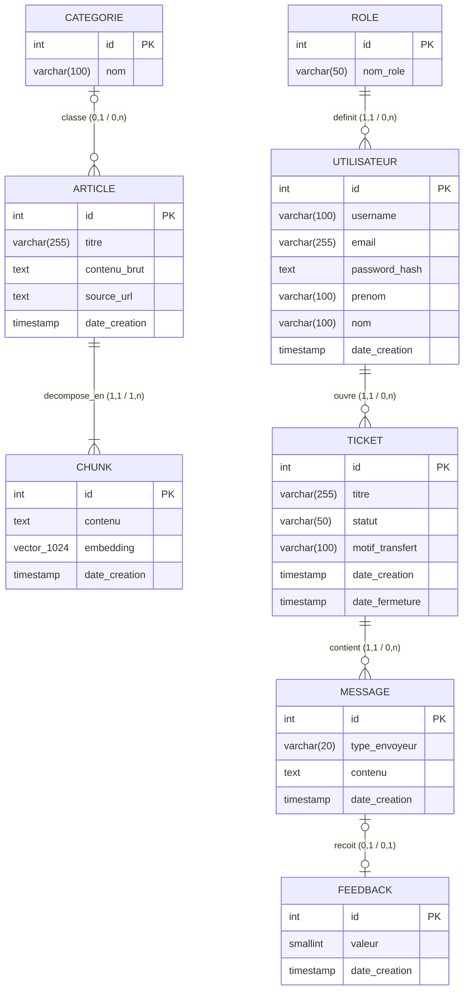

# Modélisation des données — Merise

**Projet :** SmartTicket — Gestionnaire de tickets intelligent avec assistant virtuel  
**Méthode :** Merise (MCD → MLD → MPD)  
**SGBD cible :** PostgreSQL 15+ avec extension pgvector

---

## 1. Modèle Conceptuel de Données (MCD)

Le MCD est représenté en diagramme entités-relations selon le formalisme Merise. Les cardinalités sont exprimées sous la forme `(min, max)` de chaque côté de l'association.



### Lecture des cardinalités (formalisme Merise)

| Association | Côté gauche | Côté droit |
|---|---|---|
| ROLE — definit — UTILISATEUR | Un rôle définit de 0 à n utilisateurs `(0,n)` | Un utilisateur a exactement 1 rôle `(1,1)` |
| UTILISATEUR — ouvre — TICKET | Un utilisateur ouvre de 0 à n tickets `(0,n)` | Un ticket est ouvert par exactement 1 utilisateur `(1,1)` |
| TICKET — contient — MESSAGE | Un ticket contient de 0 à n messages `(0,n)` | Un message appartient à exactement 1 ticket `(1,1)` |
| MESSAGE — reçoit — FEEDBACK | Un message reçoit 0 ou 1 feedback `(0,1)` | Un feedback porte sur 0 ou 1 message `(0,1)` |
| CATEGORIE — classe — ARTICLE | Une catégorie classe de 0 à n articles `(0,n)` | Un article appartient à 0 ou 1 catégorie `(0,1)` |
| ARTICLE — décompose_en — CHUNK | Un article est décomposé en 1 à n chunks `(1,n)` | Un chunk appartient à exactement 1 article `(1,1)` |

---

## 2. Modèle Logique de Données (MLD)

Traduction du MCD en modèle relationnel. Les clés primaires sont **soulignées**, les clés étrangères sont précédées de `#`.

```
ROLE (id, nom_role)
  Contrainte : nom_role UNIQUE NOT NULL

UTILISATEUR (id, username, email, password_hash, prenom, nom, date_creation, #id_role)
  Contrainte : email UNIQUE NOT NULL
  Contrainte : username UNIQUE NOT NULL
  CLE ETRANGERE : id_role → ROLE(id)

CATEGORIE (id, nom)
  Contrainte : nom UNIQUE NOT NULL

ARTICLE (id, titre, contenu_brut, source_url, date_creation, #id_categorie)
  Contrainte : titre NOT NULL
  CLE ETRANGERE : id_categorie → CATEGORIE(id) [SET NULL]

CHUNK (id, contenu, embedding, date_creation, #id_article)
  Contrainte : contenu NOT NULL
  Contrainte : embedding vector(1024)
  CLE ETRANGERE : id_article → ARTICLE(id) [CASCADE DELETE]

TICKET (id, titre, statut, motif_transfert, date_creation, date_fermeture, #id_utilisateur)
  Contrainte : statut IN ('open', 'transferred', 'resolved', 'closed') NOT NULL
  Contrainte : motif_transfert IN ('technique', 'complexe', 'sensible', 'autre') [NULLABLE]
  CLE ETRANGERE : id_utilisateur → UTILISATEUR(id) [CASCADE DELETE]

MESSAGE (id, type_envoyeur, contenu, date_creation, #id_ticket)
  Contrainte : type_envoyeur IN ('user', 'ai', 'sav') NOT NULL
  Contrainte : contenu NOT NULL
  CLE ETRANGERE : id_ticket → TICKET(id) [CASCADE DELETE]

FEEDBACK (id, valeur, date_creation, #id_message)
  Contrainte : valeur IN (-1, 1) NOT NULL
  Contrainte : id_message UNIQUE (un seul feedback par message)
  CLE ETRANGERE : id_message → MESSAGE(id) [CASCADE DELETE]
```

---

## 3. Modèle Physique de Données (MPD) — Script SQL DDL PostgreSQL

Script directement exécutable sur PostgreSQL 15+ avec pgvector activé.

```sql
-- =============================================================================
-- EXTENSIONS
-- =============================================================================
CREATE EXTENSION IF NOT EXISTS vector;
CREATE EXTENSION IF NOT EXISTS pgcrypto;

-- =============================================================================
-- TABLE : roles
-- =============================================================================
CREATE TABLE roles (
    id        SERIAL PRIMARY KEY,
    nom_role  VARCHAR(50) UNIQUE NOT NULL
);

-- =============================================================================
-- TABLE : utilisateur
-- =============================================================================
CREATE TABLE utilisateur (
    id             SERIAL PRIMARY KEY,
    username       VARCHAR(100) UNIQUE NOT NULL,
    email          VARCHAR(255) UNIQUE NOT NULL,
    password_hash  TEXT NOT NULL,
    prenom         VARCHAR(100),
    nom            VARCHAR(100),
    date_creation  TIMESTAMP WITH TIME ZONE DEFAULT CURRENT_TIMESTAMP,
    id_role        INTEGER NOT NULL REFERENCES roles(id) ON DELETE RESTRICT
);

-- =============================================================================
-- TABLE : categorie
-- =============================================================================
CREATE TABLE categorie (
    id   SERIAL PRIMARY KEY,
    nom  VARCHAR(100) UNIQUE NOT NULL
);

-- =============================================================================
-- TABLE : article
-- =============================================================================
CREATE TABLE article (
    id            SERIAL PRIMARY KEY,
    titre         VARCHAR(255) NOT NULL,
    contenu_brut  TEXT,
    source_url    TEXT,
    date_creation TIMESTAMP WITH TIME ZONE DEFAULT CURRENT_TIMESTAMP,
    id_categorie  INTEGER REFERENCES categorie(id) ON DELETE SET NULL
);

-- =============================================================================
-- TABLE : chunk  (fragments d'articles avec embedding vectoriel)
-- =============================================================================
CREATE TABLE chunk (
    id            SERIAL PRIMARY KEY,
    contenu       TEXT NOT NULL,
    embedding     vector(1024),
    date_creation TIMESTAMP WITH TIME ZONE DEFAULT CURRENT_TIMESTAMP,
    id_article    INTEGER NOT NULL REFERENCES article(id) ON DELETE CASCADE
);

-- =============================================================================
-- TABLE : ticket  (sessions de support, cycle : open → transferred → resolved → closed)
-- =============================================================================
CREATE TABLE ticket (
    id               SERIAL PRIMARY KEY,
    titre            VARCHAR(255),
    statut           VARCHAR(50) NOT NULL DEFAULT 'open'
                         CHECK (statut IN ('open', 'transferred', 'resolved', 'closed')),
    motif_transfert  VARCHAR(100)
                         CHECK (motif_transfert IN ('technique', 'complexe', 'sensible', 'autre')),
    date_creation    TIMESTAMP WITH TIME ZONE DEFAULT CURRENT_TIMESTAMP,
    date_fermeture   TIMESTAMP WITH TIME ZONE,
    id_utilisateur   INTEGER NOT NULL REFERENCES utilisateur(id) ON DELETE CASCADE
);

-- =============================================================================
-- TABLE : message
-- =============================================================================
CREATE TABLE message (
    id             SERIAL PRIMARY KEY,
    type_envoyeur  VARCHAR(20) NOT NULL CHECK (type_envoyeur IN ('user', 'ai', 'sav')),
    contenu        TEXT NOT NULL,
    date_creation  TIMESTAMP WITH TIME ZONE DEFAULT CURRENT_TIMESTAMP,
    id_ticket      INTEGER NOT NULL REFERENCES ticket(id) ON DELETE CASCADE
);

-- =============================================================================
-- TABLE : feedback  (évaluation d'une réponse bot par un opérateur)
-- =============================================================================
CREATE TABLE feedback (
    id            SERIAL PRIMARY KEY,
    valeur        SMALLINT NOT NULL CHECK (valeur IN (-1, 1)),
    date_creation TIMESTAMP WITH TIME ZONE DEFAULT CURRENT_TIMESTAMP,
    id_message    INTEGER NOT NULL UNIQUE REFERENCES message(id) ON DELETE CASCADE
);

-- =============================================================================
-- INDEX DE PERFORMANCE
-- =============================================================================

-- Recherche par email à l'authentification
CREATE INDEX idx_utilisateur_email
    ON utilisateur(email);

-- Filtrage des tickets par utilisateur (espace "Mes tickets")
CREATE INDEX idx_ticket_utilisateur
    ON ticket(id_utilisateur);

-- Filtrage des tickets par statut (dashboard opérateur)
CREATE INDEX idx_ticket_statut
    ON ticket(statut);

-- Chargement des messages d'un ticket
CREATE INDEX idx_message_ticket
    ON message(id_ticket);

-- Feedback par message
CREATE INDEX idx_feedback_message
    ON feedback(id_message);

-- Chunks par article (suppression en cascade, reconstruction)
CREATE INDEX idx_chunk_article
    ON chunk(id_article);

-- INDEX HNSW pour la recherche vectorielle (similarité cosinus)
-- m=16 : nombre de liens par couche ; ef_construction=64 : qualité de construction
CREATE INDEX idx_chunk_embedding_hnsw
    ON chunk
    USING hnsw (embedding vector_cosine_ops)
    WITH (m = 16, ef_construction = 64);

-- =============================================================================
-- DONNEES INITIALES
-- =============================================================================
INSERT INTO roles (nom_role) VALUES
    ('user'),
    ('sav'),
    ('admin'),
    ('ai');

-- Compte administrateur par défaut (mot de passe à changer impérativement)
-- password_hash généré avec bcrypt pour le mot de passe 'ChangeMe123!'
INSERT INTO utilisateur (username, email, password_hash, prenom, nom, id_role)
VALUES (
    'admin',
    'admin@smartticket.local',
    '$2b$12$placeholderHashReplaceWithRealBcryptHash',
    'Admin',
    'Système',
    (SELECT id FROM roles WHERE nom_role = 'admin')
);
```

### Notes d'implémentation

- **pgvector** doit être installé avant l'exécution du script (`CREATE EXTENSION IF NOT EXISTS vector`).
- L'index **HNSW** (`hnsw`) est recommandé en production pour les volumes > 100 000 chunks ; pour les développements avec peu de données, l'index IVFFlat est une alternative plus légère.
- Le `password_hash` de l'administrateur par défaut doit être régénéré avec bcrypt avant tout déploiement en production.
- La colonne `embedding vector(1024)` correspond aux embeddings produits par le modèle `mistral-embed` de Mistral AI (dimension fixe de 1 024).
