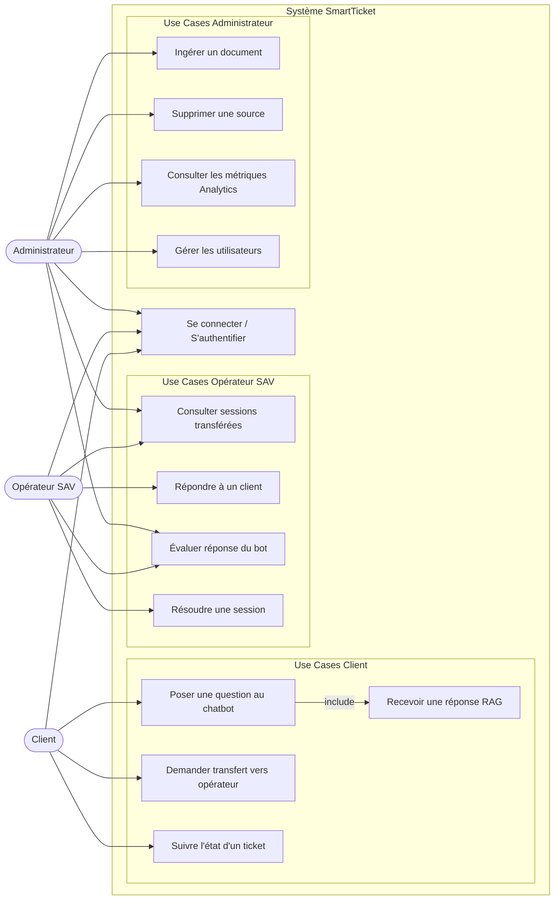
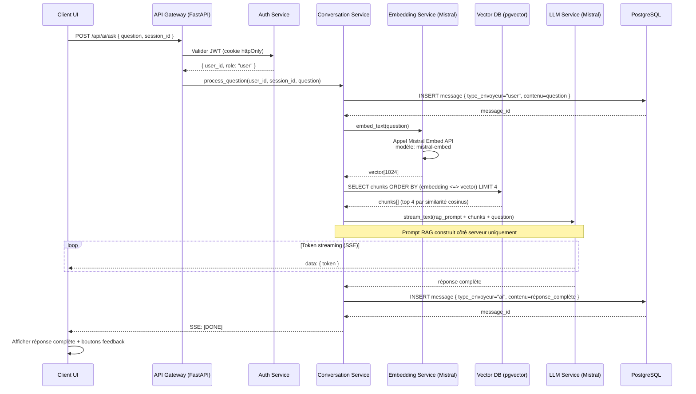
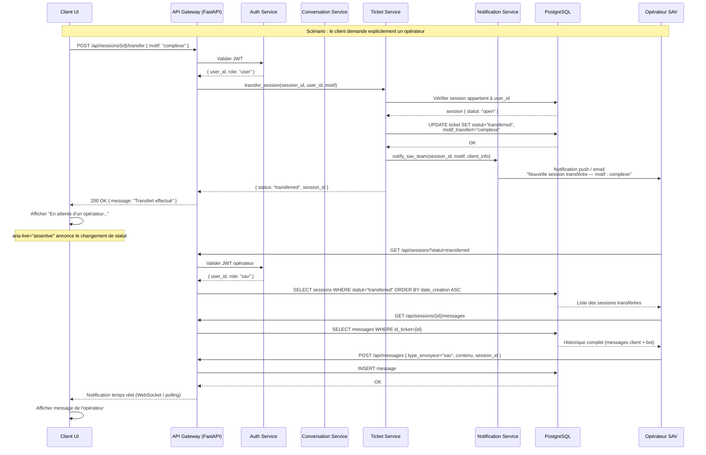
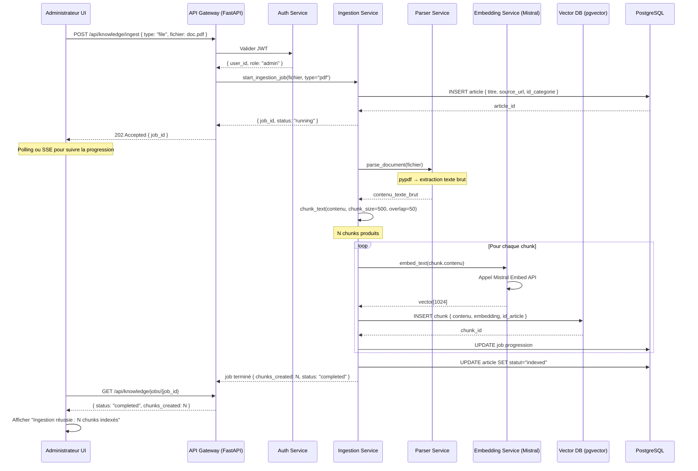
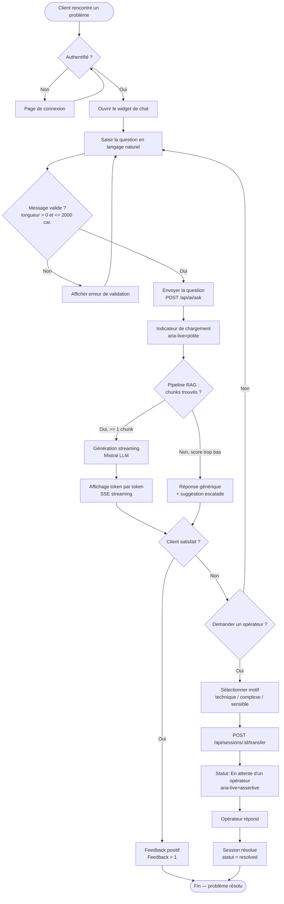
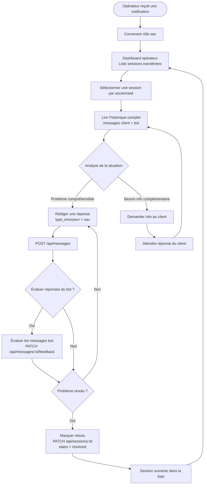
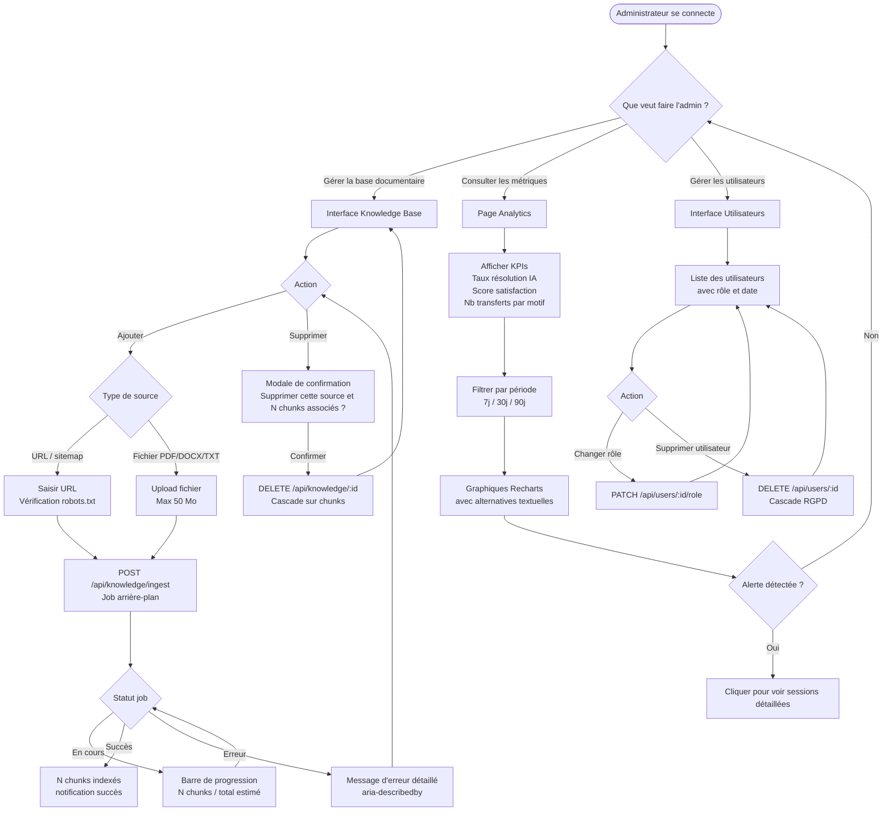

# Modélisation des parcours utilisateurs

**Projet :** SmartTicket — Gestionnaire de tickets intelligent avec assistant virtuel  
**Acteurs :** Client (rôle `user`), Opérateur SAV (rôle `sav`), Administrateur (rôle `admin`)

---

## 1. Diagramme de cas d'usage UML

Représentation des use cases par acteur. Les relations `<<include>>` signalent les comportements obligatoires inclus.

---

## 2. Diagrammes de séquence

### 2.1 Parcours nominal — Client pose une question, le bot répond (RAG complet)

---

### 2.2 Parcours d'escalade — Client pose une question, transfert vers opérateur

---

### 2.3 Parcours d'ingestion — Admin ajoute un document (chunking + embedding + indexation)

---

## 3. Schémas fonctionnels des parcours utilisateurs principaux

### 3.1 Parcours Client — Du problème à la résolution

---

### 3.2 Parcours Opérateur SAV — Traitement d'une session transférée

---

### 3.3 Parcours Administrateur — Maintenance et pilotage

