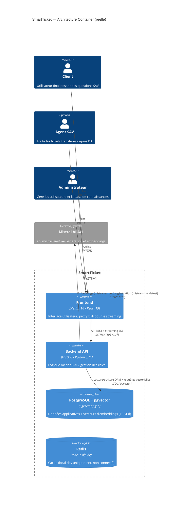

# Livrable 1 — Spécifications techniques
## SmartTicket — Gestionnaire de tickets avec assistant IA (RAG)

> **Note méthodologique** : ce document décrit l'implémentation **réelle** telle qu'elle existe dans le code source au 2026-05-08. Toutes les informations sont tirées de l'exploration directe du dépôt, pas d'un document de conception théorique.

---

## 1.1 Architecture applicative effective

### Style architectural constaté

L'architecture est un **backend-for-frontend (BFF) à deux niveaux** :

- Un **backend monolithe modulaire** (FastAPI) exposant une API REST, organisé en 7 routers thématiques.
- Un **frontend Next.js** jouant à la fois le rôle d'interface utilisateur et de proxy BFF (les routes `/api/*` de Next redirigent vers le backend via des `rewrites` et un handler SSR pour le streaming).

> **Écart vs architecture initiale** : le cahier d'architecture initial décrivait potentiellement une architecture microservices multi-services. L'implémentation effective est un monolithe modulaire à 2 services déployés + 1 base de données managée. Ce choix est cohérent avec les contraintes de coût (plan gratuit Render.com).

---

### Services effectivement présents

#### Service 1 — Backend API (`backend/`)

| Attribut | Valeur |
|---|---|
| **Rôle** | API REST, pipeline RAG, gestion des sessions/messages/utilisateurs, analytics |
| **Framework** | FastAPI (Python 3.11) |
| **Port** | 8000 |
| **Localisation** | `backend/` |

**Routers et endpoints exposés** (tous préfixés `/v1`) :

| Router | Fichier | Endpoints |
|---|---|---|
| Authentification | `routers/auth.py` | POST /register, POST /login, POST /logout, GET /me, PUT /me, PUT /me/password |
| Sessions | `routers/sessions.py` | POST /sessions, GET /sessions, DELETE /sessions/{id}, POST /sessions/{id}/close, POST /sessions/{id}/transfer, POST /sessions/{id}/resolve, GET /sessions/transferred |
| Messages | `routers/messages.py` | GET /messages, POST /messages, PATCH /messages/{id}/feedback |
| IA/RAG | `routers/ai.py` | POST /ask/stream |
| Base de connaissances | `routers/knowledge.py` | POST /knowledge-base/ingest-url, GET /knowledge-base/ingest-status, GET /knowledge-base/robots-check, GET /knowledge-base/sources, DELETE /knowledge-base/sources, POST /knowledge-base/ingest-file |
| Utilisateurs | `routers/users.py` | GET /users, PUT /users/{id}/role, PUT /users/{id}, DELETE /users/{id} |
| Analytics | `routers/analytics.py` | GET /analytics/stats |

**Dépendances externes** : Mistral AI API (`https://api.mistral.ai/v1`)

#### Service 2 — Frontend (`frontend/`)

| Attribut | Valeur |
|---|---|
| **Rôle** | Interface utilisateur, proxy BFF pour le streaming SSE |
| **Framework** | Next.js 16.1.6 (App Router) |
| **Port** | 3005 |
| **Localisation** | `frontend/` |

**Routes applicatives** :

| Route | Rôle |
|---|---|
| `/` | Dashboard (liste des sessions de chat) |
| `/ai-assistant/[id]` | Interface de chat avec l'assistant IA |
| `/analytics` | Dashboard analytique (admin/SAV uniquement) |
| `/knowledge-base` | Gestion de la base de connaissances |
| `/settings` | Paramètres de profil utilisateur |
| `/login`, `/sign-up`, `/forgot-password` | Authentification |

**Proxy API** : `next.config.ts` redirige `/api/*` → `backend:8000/v1/*` via `rewrites()`. Le handler `app/api/ask/route.ts` proxifie spécifiquement le streaming de l'endpoint `/v1/ask/stream`.

#### Service 3 — PostgreSQL + pgvector

| Attribut | Valeur |
|---|---|
| **Image** | `pgvector/pgvector:pg16` (local) / PostgreSQL managé Render (pré-prod) |
| **Port** | 5432 |
| **Base** | `ticketdb` |
| **Extensions** | `vector` (pgvector), `pgcrypto` |
| **Index** | HNSW sur `knowledge_base.embedding` (cosine_ops) |

#### Service 4 — Redis (local uniquement)

| Attribut | Valeur |
|---|---|
| **Image** | `redis:7-alpine` |
| **Port** | 6379 |
| **Usage en prod** | Non déployé — prévu pour la mise en cache, non connecté dans le code backend actuel |

---

### Diagramme C4 — Niveau Container (basé sur le code réel)



---

## 1.2 Stack technique effective

### Frontend (`frontend/package.json`)

| Lib | Version | Rôle |
|---|---|---|
| next | ^16.1.6 | Framework React (App Router, SSR, API routes) |
| react | 19.2.3 | Moteur UI |
| react-dom | 19.2.3 | Rendu DOM |
| typescript | ^5 | Typage statique |
| tailwindcss | ^4 | CSS utilitaire |
| @radix-ui/react-dialog | ^1.1.15 | Modaux accessibles (WCAG 2.1) |
| @base-ui/react | ^1.0.0 | Composants UI accessibles |
| radix-ui | ^1.4.3 | Suite de primitives UI |
| lucide-react | ^0.562.0 | Icônes SVG |
| recharts | ^3.6.0 | Graphiques SVG (dashboard analytics) |
| shadcn | ^3.6.3 | Générateur de composants basé Radix |
| streamdown | ^2.4.0 | Rendu Markdown pour réponses streamées |
| clsx + tailwind-merge | ^2.1.1 / ^3.4.0 | Gestion conditionnelle des classes CSS |
| tw-animate-css | ^1.4.0 | Animations CSS déclaratives |

**Outils de test frontend** : jest ^29, @testing-library/react ^16, ts-jest ^29

### Backend (`backend/requirements.txt`)

| Lib | Version | Rôle |
|---|---|---|
| fastapi | latest | Framework API REST async |
| uvicorn | latest | Serveur ASGI |
| sqlalchemy | latest | ORM Python |
| psycopg2-binary | latest | Driver PostgreSQL |
| pgvector | latest | Extension pgvector pour SQLAlchemy |
| passlib[bcrypt] | latest | Hachage de mots de passe |
| bcrypt | 4.0.1 | Algorithme bcrypt (épinglé pour compatibilité) |
| python-jose[cryptography] | latest | Génération/validation JWT HS256 |
| email-validator | >=2.0.0 | Validation format email (Pydantic) |
| python-dotenv | latest | Chargement des variables d'environnement |
| requests | latest | Client HTTP synchrone (appels Mistral API) |
| langchain-community | latest | Scraping web + intégrations LangChain |
| langchain-text-splitters | latest | Découpage de texte en chunks pour le RAG |
| beautifulsoup4 | latest | Parsing HTML (ingestion de pages web) |
| lxml | 6.0.2 | Parser XML/HTML performant |
| pypdf | 6.9.2 | Lecture et extraction de texte PDF |
| python-docx | 1.2.0 | Lecture de fichiers DOCX |
| typing-extensions | 4.15.0 | Compatibilité types Python |

**Outils de test backend** : pytest, pytest-cov, httpx

### Bases de données et services

| Service | Image Docker | Version | Usage |
|---|---|---|---|
| PostgreSQL | `pgvector/pgvector:pg16` | PostgreSQL 16 + pgvector | Données applicatives et vectorielles |
| PostgreSQL (CI) | `pgvector/pgvector:pg15` | PostgreSQL 15 + pgvector | Tests d'intégration CI uniquement |
| Redis | `redis:7-alpine` | Redis 7 | Prévu pour cache (non connecté en prod) |
| pgAdmin | `dpage/pgadmin4` | latest | Administration DB (dev uniquement) |
| Ollama | `ollama/ollama:latest` | latest | LLM local (dev uniquement, non utilisé en prod) |
| Open WebUI | `ghcr.io/open-webui/open-webui:main` | latest | Interface Ollama (dev uniquement) |

### Services IA

| Modèle | Fournisseur | Usage | Variable d'env |
|---|---|---|---|
| `mistral-small-latest` | Mistral AI | Génération de réponses (streaming SSE) + résumés de sessions à la clôture | `MISTRAL_MODEL` |
| `mistral-embed` | Mistral AI | Vectorisation des questions et des documents (1024 dimensions) | `EMBED_MODEL` |

Code source : `backend/mistral_client.py` (fonctions `stream_text`, `generate_text`, `embed_text`)

---

## 1.3 Dépendances et environnement d'exécution

### Backend (`backend/Dockerfile`)

| Paramètre | Valeur |
|---|---|
| **Image de base** | `python:3.11-slim` |
| **Dépendances système** | `libpq-dev`, `gcc` (pour psycopg2-binary) |
| **Port exposé** | 8000 |
| **Commande de démarrage** | `uvicorn main:app --host 0.0.0.0 --port ${PORT:-8000}` |
| **Variables d'env requises** | `SECRET_KEY`, `DATABASE_URL`, `MISTRAL_API_KEY`, `CORS_ORIGINS` |
| **Variables d'env optionnelles** | `ALGORITHM`, `ACCESS_TOKEN_EXPIRE_MINUTES`, `MISTRAL_MODEL`, `EMBED_MODEL`, `KB_TOP_K`, `KB_MAX_CONTEXT_CHARS`, `SUMMARY_MAX_CHARS` |
| **Volumes** | `./backend:/app` (dev) |

### Frontend (`frontend/Dockerfile`)

| Paramètre | Valeur |
|---|---|
| **Image de base** | `node:20-slim` |
| **Build arg** | `NEXT_PUBLIC_API_URL` (injecté au moment du build) |
| **Port exposé** | 3005 |
| **Commande de démarrage** | `npm run start -- -p ${PORT:-3005}` |
| **Variables d'env requises** | `NEXT_PUBLIC_API_URL` |
| **Mode** | `NODE_ENV=production` |

### PostgreSQL (`docker-compose.yml`)

| Paramètre | Valeur |
|---|---|
| **Image** | `pgvector/pgvector:pg16` |
| **Port** | 5432 |
| **Volumes** | `./data/postgres:/var/lib/postgresql/data` |
| **Init SQL** | `./backend/db/init-db.sql` (extensions, tables, index HNSW, compte admin par défaut) |
| **Variables d'env** | `POSTGRES_DB=ticketdb`, `POSTGRES_USER=admin`, `POSTGRES_PASSWORD=Password1234` |

---

## 1.4 Sécurité implémentée

### Authentification

**JWT (HS256) + Cookie httpOnly** — `backend/dependencies.py:38-59` + `backend/routers/auth.py:37-48`

```
dependencies.py:38   SECRET_KEY = os.getenv("SECRET_KEY")
dependencies.py:39   ALGORITHM = os.getenv("ALGORITHM", "HS256")
dependencies.py:40   ACCESS_TOKEN_EXPIRE_MINUTES = int(os.getenv("ACCESS_TOKEN_EXPIRE_MINUTES", 60))
auth.py:41           response.set_cookie(key="auth_token", value=access_token, httponly=True,
auth.py:42               samesite="strict", secure=cookie_secure, max_age=ACCESS_TOKEN_EXPIRE_MINUTES * 60)
```

Le token est émis dans un cookie `httpOnly` + `SameSite=strict` (protection CSRF et XSS). Il peut aussi être transmis via header `Authorization: Bearer` (dual mode).

**Validation du token** — `backend/dependencies.py:62-75`

```
dependencies.py:62   def get_current_user(request: Request, token: str | None = Depends(oauth2_scheme)) -> str:
dependencies.py:63       if not token:
dependencies.py:64           token = request.cookies.get("auth_token")
dependencies.py:67       payload = jwt.decode(token, SECRET_KEY, algorithms=[ALGORITHM])
```

**Hachage des mots de passe** — `backend/dependencies.py:30` + `backend/db/init-db.sql`

```
dependencies.py:30   pwd_context = CryptContext(schemes=["bcrypt"], deprecated="auto")
init-db.sql:         crypt('admin', gen_salt('bf'))   -- bcrypt via pgcrypto
```

### RBAC (Contrôle d'accès basé sur les rôles)

4 rôles : `user`, `ai`, `sav`, `admin`

**Vérification des rôles** — `backend/dependencies.py:78-82`

```
dependencies.py:78   def is_admin_or_sav(user: models.Utilisateur | None) -> bool:
dependencies.py:79       if not user or not user.role:
dependencies.py:80           return False
dependencies.py:81       return user.role.nom_role in ["admin", "sav"]
```

Utilisé sur : `GET /analytics/stats`, `GET /sessions/transferred`, `POST /knowledge-base/ingest-url`, `POST /knowledge-base/ingest-file`, `DELETE /knowledge-base/sources`, `GET /users`, `PUT /users/{id}/role`, `PUT /users/{id}`, `DELETE /users/{id}`

Vérification admin stricte sur les routes d'administration (`users.py` vérifie `nom_role == "admin"` directement).

### CORS

**Middleware CORS** — `backend/main.py:28-38`

```
main.py:28   cors_origins = [origin.strip() for origin in os.getenv("CORS_ORIGINS", "...").split(",")]
main.py:36   app.add_middleware(CORSMiddleware,
main.py:37       allow_origins=cors_origins, allow_credentials=True,
main.py:38       allow_methods=["*"], allow_headers=["*"])
```

Les origines autorisées sont configurées via la variable `CORS_ORIGINS`. En pré-production, Render injecte automatiquement l'URL du frontend.

### Validation des entrées

**Pydantic v2** — `backend/schemas.py` : tous les payloads entrants sont validés par des modèles Pydantic avec `EmailStr`, `HttpUrl`, contraintes de longueur. Exemple : `AskRequest`, `UserCreate`, `TransferRequest`.

**Sanitisation des textes** — `backend/dependencies.py:25`

```
dependencies.py:25   def sanitize_text(value: str) -> str:
dependencies.py:26       return value.replace("\x00", "").strip()
```

Suppression des caractères nuls avant stockage (protection contre l'injection PostgreSQL via NULL bytes).

### Gestion des secrets

Les secrets sont externalisés via variables d'environnement (`.env` non commité). En pré-prod Render, `SECRET_KEY` est généré automatiquement (`generateValue: true` dans `render.yaml`). `MISTRAL_API_KEY` est injecté manuellement dans les variables d'environnement Render.

**Vérification au démarrage** — `backend/main.py:19`

```
main.py:19   if not os.getenv("SECRET_KEY"):
main.py:20       raise RuntimeError("SECRET_KEY manquante.")
```

### Mesures OWASP non implémentées (lacunes honnêtes)

| Vulnérabilité OWASP API | Statut | Recommandation |
|---|---|---|
| **Rate limiting** (API2:2023) | ❌ Absent | Ajouter `slowapi` (limiter sur `/v1/login`, `/v1/ask/stream`) |
| **Security headers** (Helmet) | ❌ Absent | Ajouter `secure-headers` middleware ou configurer Nginx/Caddy en reverse proxy |
| **Refresh tokens** | ❌ Absent | Token JWT fixe 60 min. Implémenter rotation via Redis |
| **Audit log** | ❌ Absent | Les suppressions et changements de rôle ne sont pas journalisés (sauf `DELETE /knowledge-base/sources` — `logger.info` présent dans `knowledge.py:37`) |
| **Validation de la taille des uploads** | ⚠️ Partiel | `ingest-file` vérifie l'extension mais pas la taille du fichier en bytes |

---

## 1.5 Méthodologie de développement constatée

### Workflow Git

Branche principale : `master`. Développement direct sur master (commits récents : `ajout de la fonction c14`, `validation c10`, `correction pour CI`, `amélioration de la structure du main`).

Convention de commits : messages en français, style descriptif court (ex : `ajout d'analyse des analytics des réponses de l'ia`, `correction pour CI`).

### Pipeline CI/CD

Déclenché sur push et pull request vers `master`. Deux jobs :

```
Job 1 — backend-tests :
  Python 3.11 → pip install → pytest tests/ -v --tb=short
  (service postgres pgvector:pg15 en sidecar)

Job 2 — frontend-tests :
  Node 20 → npm ci → tsc --noEmit → eslint → jest → npm run build
```

### Tests

**Backend** (`backend/tests/`) :
- `test_api.py` : tests d'intégration couvrant auth (register, login, logout, profil), sessions (create, list, accès inter-utilisateurs), messages
- `test_utils.py` : tests unitaires utilitaires
- `conftest.py` : fixtures (client HTTP, utilisateur inscrit, client authentifié)
- Framework : pytest + httpx (`TestClient` FastAPI)

**Frontend** (`frontend/__tests__/`) :
- `api.test.ts` : tests de l'API proxy
- `utils.test.ts` : tests utilitaires
- Framework : jest + @testing-library/react

**Couverture** : configurée via `pytest-cov` (rapport non quantifié dans le repo).

---

## 1.6 Environnements

### Environnement de développement local

Tous les services orchestrés par `docker-compose.yml` :

| Service | URL locale |
|---|---|
| Frontend | http://localhost:3005 |
| Backend API | http://localhost:8000 |
| Swagger UI | http://localhost:8000/docs |
| pgAdmin | http://localhost:5050 |
| Ollama | http://localhost:11434 |
| Open WebUI | http://localhost:3002 |

Commande : `docker compose up -d --build`

### Environnement de pré-production (Render.com)

| Service | Hébergeur | URL |
|---|---|---|
| Backend | Render.com (Free) | `https://pfe-ece-backend.onrender.com` *(à confirmer)* |
| Frontend | Render.com (Free) | `https://pfe-ece-frontend.onrender.com` *(à confirmer)* |
| PostgreSQL | Render.com Managed DB (Free) | Interne au réseau Render |

> **Action requise** : confirmer les URLs réelles de pré-production avant livraison finale du livrable 4.

Déploiement déclenché manuellement via `render.yaml` (ou push Git si Render est connecté au dépôt GitHub).

### Environnement de production

Pas d'environnement de production distinct de la pré-production à ce stade du projet.
