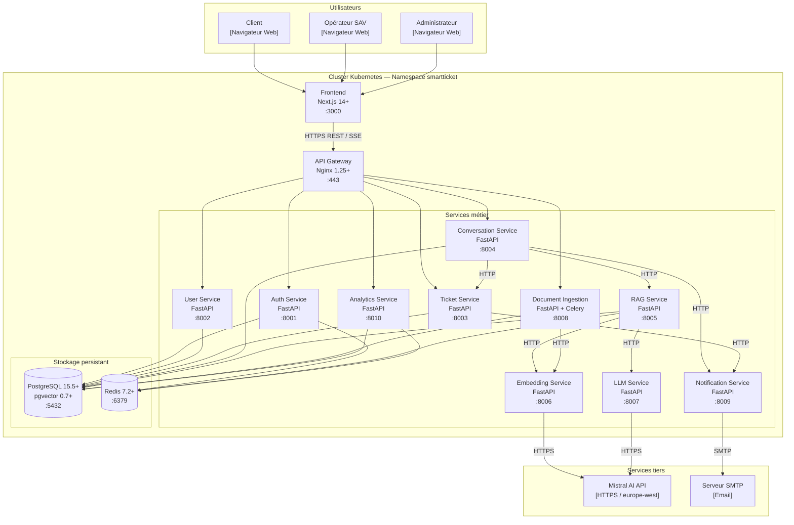

# Spécifications techniques détaillées

**Projet :** SmartTicket — Gestionnaire de tickets intelligent avec assistant virtuel  
**Stack :** Next.js 14+ / FastAPI (Python 3.11+) / PostgreSQL 15.5+ + pgvector / Mistral API / Redis 7.2+ / Docker / Kubernetes  
**Compétence :** C15 — Cadre technique d'une application intégrant un service d'IA

---

## 1.1 Architecture applicative

### Style architectural retenu : microservices

**Justification :** Le périmètre fonctionnel (chat RAG, ingestion documentaire, gestion de tickets, analytics) regroupe des domaines métier aux profils de charge radicalement différents — la génération LLM est CPU/réseau intensif, l'ingestion documentaire est I/O intensif, les analytics sont read-heavy. Un découpage en services permet de scaler chaque composant indépendamment, d'isoler les pannes (la défaillance du LLM Service n'impacte pas la liste des tickets), et de déployer les évolutions du pipeline RAG sans couper l'interface utilisateur.

La mise en œuvre suit une progression en deux temps : phase 1 (MVP) — monolithe modulaire FastAPI avec séparation logique en routers/modules ; phase 2 — extraction progressive des services à fort différentiel de charge (RAG Service, Embedding Service, Document Ingestion Service) vers des conteneurs autonomes.

### Découpage en services

#### API Gateway

| Attribut | Valeur |
|---|---|
| **Rôle** | Point d'entrée unique, reverse proxy, routage, rate limiting, terminaison TLS |
| **Responsabilités** | Routage des requêtes vers les services en aval, validation du JWT à la périphérie, rate limiting par IP et par user_id, journalisation des accès (access log structuré JSON) |
| **Interface** | Expose `HTTPS :443`, routes vers les services internes via HTTP |
| **Technologie** | Nginx 1.25+ (phase 1) → Kong Gateway 3.5+ (phase 2) |
| **Dépendances** | Auth Service (validation JWT), tous les services métier |

#### Auth Service

| Attribut | Valeur |
|---|---|
| **Rôle** | Authentification, délivrance et renouvellement de tokens JWT |
| **Responsabilités** | `POST /auth/login` (vérification bcrypt, délivrance access token 15 min + refresh token 7 j), `POST /auth/refresh` (rotation du refresh token), `POST /auth/logout` (invalidation en Redis), introspection JWT pour les autres services |
| **Interface** | `GET /auth/introspect` → `{ user_id, role, exp }` |
| **Dépendances** | PostgreSQL (table `utilisateur`), Redis (blacklist des tokens révoqués) |

#### User Service

| Attribut | Valeur |
|---|---|
| **Rôle** | CRUD utilisateurs, gestion des rôles |
| **Responsabilités** | `GET /users/me`, `PUT /users/me`, `DELETE /users/{id}` (RGPD — cascade), `PATCH /users/{id}/role` (admin seulement), liste paginée des utilisateurs |
| **Interface** | REST JSON, rôle vérifié via JWT |
| **Dépendances** | PostgreSQL (tables `utilisateur`, `roles`) |

#### Ticket Service

| Attribut | Valeur |
|---|---|
| **Rôle** | Cycle de vie des tickets de support |
| **Responsabilités** | Création de ticket (`POST /tickets`), consultation (`GET /tickets`, `GET /tickets/{id}`), transitions de statut (`PATCH /tickets/{id}/status`) : `open → transferred → resolved → closed` |
| **Interface** | REST JSON ; filtre `?statut=`, `?id_utilisateur=` côté serveur uniquement |
| **Dépendances** | PostgreSQL (table `ticket`) |

#### Conversation Service

| Attribut | Valeur |
|---|---|
| **Rôle** | Orchestration de la session de chat, persistence des messages |
| **Responsabilités** | Réception de la question client, déclenchement du pipeline RAG, streaming de la réponse via SSE, persistance des messages (`user`, `ai`, `sav`), enregistrement du feedback opérateur |
| **Interface** | `POST /conversations/ask` → SSE stream ; `GET /conversations/{ticket_id}/messages` ; `PATCH /messages/{id}/feedback` |
| **Dépendances** | RAG Service, Ticket Service, PostgreSQL (tables `message`, `feedback`) |

#### Document Ingestion Service

| Attribut | Valeur |
|---|---|
| **Rôle** | Ingestion asynchrone de documents, chunking, déclenchement de l'embedding |
| **Responsabilités** | Parsing PDF/DOCX/TXT (pypdf, python-docx), chunking (500 caractères, chevauchement 50), dispatch vers Embedding Service, persistance des chunks en base, suivi des jobs d'ingestion |
| **Interface** | `POST /knowledge/ingest` → 202 + `{ job_id }` ; `GET /knowledge/jobs/{job_id}` → statut + progression |
| **Dépendances** | Embedding Service, PostgreSQL (tables `article`, `chunk`), Redis (file de jobs Celery) |

#### RAG Service

| Attribut | Valeur |
|---|---|
| **Rôle** | Orchestration du pipeline Retrieval-Augmented Generation |
| **Responsabilités** | Encode la question via Embedding Service → recherche cosinus HNSW dans pgvector (top K=4) → vérifie le cache Redis → construit le prompt RAG côté serveur → appelle LLM Service en streaming → met en cache la réponse si score de confiance élevé |
| **Interface** | `POST /rag/query` → `{ answer, sources[], confidence }` |
| **Dépendances** | Embedding Service, LLM Service, PostgreSQL (table `chunk` + index HNSW), Redis (cache réponses) |

#### Embedding Service

| Attribut | Valeur |
|---|---|
| **Rôle** | Wrapper Mistral Embed API |
| **Responsabilités** | Reçoit du texte brut, appelle `mistral-embed`, retourne le vecteur 1024-d. Gère le retry (3 tentatives, backoff exponentiel) et le batch (jusqu'à 32 textes par appel) |
| **Interface** | `POST /embed` `{ texts: string[] }` → `{ embeddings: float[1024][] }` |
| **Dépendances** | Mistral API (externe) |

#### LLM Service

| Attribut | Valeur |
|---|---|
| **Rôle** | Wrapper Mistral Chat Completion API |
| **Responsabilités** | Reçoit le prompt RAG complet, appelle `mistral-large-latest` (requêtes complexes) ou `mistral-small-latest` (requêtes simples détectées par heuristique de longueur), retourne la réponse en streaming (SSE) |
| **Interface** | `POST /llm/chat` `{ prompt, stream: bool, model_hint }` → SSE tokens |
| **Dépendances** | Mistral API (externe) |

#### Notification Service

| Attribut | Valeur |
|---|---|
| **Rôle** | Envoi de notifications aux opérateurs lors des transferts de sessions |
| **Responsabilités** | Notification email (SMTP) et WebSocket push lors du passage d'un ticket en statut `transferred`, notification de résolution |
| **Interface** | `POST /notifications/send` `{ recipients[], event_type, payload }` (appelé en interne) |
| **Dépendances** | PostgreSQL (table `utilisateur` pour les emails SAV), SMTP externe |

#### Analytics Service

| Attribut | Valeur |
|---|---|
| **Rôle** | Calcul et mise en cache des métriques de performance |
| **Responsabilités** | `GET /analytics?periode=30d` → agrégats : taux de résolution IA, score de satisfaction, ventilation des transferts par motif, évolution temporelle sur 7/30/90 jours |
| **Interface** | `GET /analytics` (admin seulement, 403 sinon) |
| **Dépendances** | PostgreSQL (tables `ticket`, `message`, `feedback`), Redis (cache des agrégats, TTL 1 h) |

### Diagramme C4 — niveau Container



---

## 1.2 Architecture technique

### Stack frontend

| Outil | Version minimale | Justification |
|---|---|---|
| **Next.js** (App Router) | 14.2+ | Framework React SSR/SSG, routing file-system, optimisations images intégrées, Server Components pour réduire le JS client |
| **React** | 18.3+ | Inclus dans Next.js ; Server Components, Concurrent Mode, Suspense |
| **TypeScript** | 5.4+ | Typage statique, détection des erreurs à la compilation, inférence des types d'API via `zod` |
| **TailwindCSS** | 3.4+ | Utility-first CSS, tree-shaking automatique, aucun CSS mort en production |
| **TanStack Query** | 5.28+ | Cache server-state, invalidation, pagination, prefetching |
| **Zustand** | 4.5+ | État UI local léger (session chat, préférences) — < 1 KB gzippé |
| **Recharts** | 2.12+ | Graphiques accessibles (SVG avec alternatives textuelles), utilisé dans le dashboard Analytics (US-08) |
| **Zod** | 3.23+ | Validation des données côté client et génération de schémas TypeScript |

### Stack backend

**Langage / framework retenu : Python 3.11+ / FastAPI 0.111+**

Justification par rapport à Node.js/NestJS :
- L'écosystème Python (numpy, scikit-learn, pypdf, python-docx, LangChain, sentence-transformers) est natif pour le traitement NLP et le pipeline RAG.
- FastAPI offre une performance asynchrone comparable à NestJS (basé sur Starlette/uvicorn), avec génération automatique d'OpenAPI.
- L'Embedding Service et le Document Ingestion Service bénéficient directement des bibliothèques Python de traitement de fichiers.
- La cohérence de l'écosystème (un seul langage pour tous les services backend) réduit la charge cognitive et simplifie la CI.

| Outil | Version minimale | Rôle |
|---|---|---|
| **FastAPI** | 0.111+ | Framework ASGI, routes async, génération OpenAPI automatique |
| **Uvicorn** | 0.29+ | Serveur ASGI production (workers + Gunicorn) |
| **SQLAlchemy** | 2.0+ | ORM async (asyncpg), gestion des transactions, migrations via Alembic |
| **Alembic** | 1.13+ | Migrations de schéma SQL versionnées |
| **Pydantic v2** | 2.7+ | Validation des données d'entrée/sortie, schémas OpenAPI |
| **asyncpg** | 0.29+ | Driver PostgreSQL async hautes performances |
| **redis-py** | 5.0+ | Client Redis async (via `aioredis`) |
| **Celery** | 5.3+ | File de tâches asynchrones pour le Document Ingestion Service |
| **pypdf** | 4.2+ | Extraction texte PDF |
| **python-docx** | 1.1+ | Extraction texte DOCX |
| **passlib[bcrypt]** | 1.7.4+ | Hachage bcrypt des mots de passe |
| **python-jose** | 3.3+ | Génération et validation JWT |
| **httpx** | 0.27+ | Client HTTP async pour les appels inter-services et Mistral API |

### Bases de données

**PostgreSQL 15.5+ avec pgvector 0.7+**

- Stockage relationnel principal (utilisateurs, tickets, messages, articles, feedbacks).
- Extension `pgvector` : colonne `embedding vector(1024)` sur la table `chunk`, index HNSW (`m=16`, `ef_construction=64`) pour la recherche par similarité cosinus en O(log n).
- Extension `pgcrypto` pour le hachage côté base (données sensibles).
- Configuration production : `max_connections=200`, `shared_buffers=2GB`, `work_mem=64MB`, `effective_cache_size=6GB`.

**Redis 7.2+**

- Cache des réponses RAG (TTL 1 h, clé = hash SHA-256 de la question normalisée).
- Cache des métriques Analytics (TTL 1 h).
- Blacklist des refresh tokens révoqués (TTL = durée de vie du token = 7 jours).
- File de tâches Celery (broker) pour le Document Ingestion Service.

### Services IA

| Service | Modèle | Usage | Dimension | Notes |
|---|---|---|---|---|
| **Mistral Embed** | `mistral-embed` | Encodage de questions et chunks | 1024-d | Cosinus similarity, batch jusqu'à 32 textes |
| **Mistral Chat (complexe)** | `mistral-large-latest` | Questions nécessitant un raisonnement multi-étapes | — | Température 0.1 pour la reproductibilité |
| **Mistral Chat (simple)** | `mistral-small-latest` | Questions courtes, FAQ | — | Réduction de coût × 3-5 vs large |

Le choix du modèle (`large` vs `small`) est déterminé par une heuristique côté LLM Service : longueur de la question > 100 tokens ou présence de mots-clés complexité (`pourquoi`, `comment fonctionne`, `expliquez`) → `mistral-large-latest`, sinon → `mistral-small-latest`.

### Communication inter-services

**Choix retenu : REST HTTP synchrone (phase 1) + Redis Pub/Sub pour les événements asynchrones (phase 2)**

Justification : les appels critiques (RAG, authentification) sont synchrones et bénéficient de la faible latence du réseau intra-cluster Kubernetes. Les événements asynchrones (notification de transfert, job d'ingestion) transitent par Redis Pub/Sub sans nécessiter un message broker dédié (Kafka serait surdimensionné pour ce volume). Un bus Kafka ne sera introduit que si le volume dépasse 10 000 tickets/jour.

Communication interne : HTTP/1.1 avec keep-alive sur le réseau privé Kubernetes (ClusterIP). Les appels Mistral API : HTTPS/TLS 1.3.

### Authentification

- **Access token** : JWT signé HS256, durée 15 minutes, payload `{ user_id, role, exp }`.
- **Refresh token** : JWT opaque stocké en cookie `httpOnly; Secure; SameSite=Strict`, durée 7 jours, rotation à chaque refresh.
- **RBAC** : 4 rôles (`user`, `sav`, `admin`, `ai`). Chaque endpoint FastAPI porte un decorator `@require_role(["sav", "admin"])` qui lit le rôle du JWT — jamais d'un paramètre HTTP.
- **Invalidation** : les refresh tokens révoqués sont stockés dans Redis avec TTL correspondant à leur expiration.

### Observabilité

| Outil | Version | Usage |
|---|---|---|
| **Prometheus** | 2.51+ | Métriques applicatives (latences, taux d'erreur, tokens Mistral/min) |
| **Grafana** | 10.4+ | Dashboards opérationnels : latence P95 RAG, hit rate cache, erreurs 5xx |
| **Loki** | 3.0+ | Agrégation des logs structurés JSON de tous les services |
| **OpenTelemetry SDK (Python)** | 1.24+ | Traces distribuées : traçabilité d'une requête RAG de l'API Gateway au LLM Service |
| **Sentry** | 1.44+ | Alerting erreurs applicatives en temps réel |

---

## 1.3 Dépendances et environnement d'exécution

### Tableau récapitulatif par composant

| Composant | Version minimale | Runtime/OS | Variables d'environnement clés | Port exposé | Volume persistant |
|---|---|---|---|---|---|
| **Frontend (Next.js)** | Node.js 20.11 LTS | Alpine Linux 3.19 | `NEXT_PUBLIC_API_URL`, `NEXTAUTH_SECRET` | 3000 | — |
| **API Gateway (Nginx)** | Nginx 1.25.4 | Alpine Linux 3.19 | — | 80, 443 | `/etc/nginx/certs` (TLS) |
| **Auth Service** | Python 3.11.9 | Alpine Linux 3.19 | `JWT_SECRET`, `JWT_REFRESH_SECRET`, `DATABASE_URL`, `REDIS_URL`, `BCRYPT_ROUNDS=12` | 8001 | — |
| **User Service** | Python 3.11.9 | Alpine Linux 3.19 | `DATABASE_URL` | 8002 | — |
| **Ticket Service** | Python 3.11.9 | Alpine Linux 3.19 | `DATABASE_URL` | 8003 | — |
| **Conversation Service** | Python 3.11.9 | Alpine Linux 3.19 | `DATABASE_URL`, `REDIS_URL`, `RAG_SERVICE_URL`, `TICKET_SERVICE_URL` | 8004 | — |
| **RAG Service** | Python 3.11.9 | Alpine Linux 3.19 | `DATABASE_URL`, `REDIS_URL`, `EMBED_SERVICE_URL`, `LLM_SERVICE_URL`, `RAG_TOP_K=4`, `RAG_CACHE_TTL=3600` | 8005 | — |
| **Embedding Service** | Python 3.11.9 | Alpine Linux 3.19 | `MISTRAL_API_KEY`, `MISTRAL_EMBED_MODEL=mistral-embed`, `EMBED_BATCH_SIZE=32` | 8006 | — |
| **LLM Service** | Python 3.11.9 | Alpine Linux 3.19 | `MISTRAL_API_KEY`, `MISTRAL_LARGE_MODEL=mistral-large-latest`, `MISTRAL_SMALL_MODEL=mistral-small-latest`, `LLM_TEMPERATURE=0.1`, `LLM_MAX_TOKENS=2048` | 8007 | — |
| **Document Ingestion Service** | Python 3.11.9 | Alpine Linux 3.19 | `DATABASE_URL`, `EMBED_SERVICE_URL`, `CELERY_BROKER_URL`, `CHUNK_SIZE=500`, `CHUNK_OVERLAP=50`, `MAX_FILE_SIZE_MB=50` | 8008 | `/tmp/uploads` |
| **Notification Service** | Python 3.11.9 | Alpine Linux 3.19 | `DATABASE_URL`, `SMTP_HOST`, `SMTP_PORT=587`, `SMTP_USER`, `SMTP_PASSWORD`, `EMAIL_FROM` | 8009 | — |
| **Analytics Service** | Python 3.11.9 | Alpine Linux 3.19 | `DATABASE_URL`, `REDIS_URL`, `ANALYTICS_CACHE_TTL=3600` | 8010 | — |
| **PostgreSQL** | 15.5 | Alpine Linux 3.19 | `POSTGRES_DB=smartticket`, `POSTGRES_USER`, `POSTGRES_PASSWORD` | 5432 | `/var/lib/postgresql/data` |
| **Redis** | 7.2.4 | Alpine Linux 3.19 | `REDIS_PASSWORD`, `REDIS_MAXMEMORY=512mb`, `REDIS_MAXMEMORY_POLICY=allkeys-lru` | 6379 | `/data` |
| **Celery Worker** | Celery 5.3 | Python 3.11.9 / Alpine | identiques à Document Ingestion Service | — | `/tmp/uploads` (partagé) |

### Contraintes système globales

- **Kubernetes** : 1.29+ avec support Horizontal Pod Autoscaler (HPA).
- **Docker Engine** : 26.0+ (BuildKit obligatoire pour les builds multi-stage).
- **Helm** : 3.14+ pour le déploiement sur Kubernetes.
- **Cert-manager** : 1.14+ pour la gestion automatique des certificats TLS Let's Encrypt.

---

## 1.4 Sécurité

### OWASP Top 10 2021 — application au projet

Référence officielle : [https://owasp.org/Top10/](https://owasp.org/Top10/)

| # | Risque OWASP 2021 | Mesure appliquée dans SmartTicket |
|---|---|---|
| **A01** | Broken Access Control | RBAC strict : chaque endpoint vérifie le rôle extrait du JWT. Filtre `id_utilisateur` appliqué côté serveur sur toutes les requêtes de données. Test d'intégration dédié pour chaque route protégée. |
| **A02** | Cryptographic Failures | Mots de passe hachés bcrypt (coût 12). TLS 1.3 obligatoire (HSTS préchargé). Chiffrement at-rest PostgreSQL via LUKS au niveau disque Kubernetes PVC. Aucune donnée sensible en log. |
| **A03** | Injection | Paramètres SQL exclusivement via SQLAlchemy ORM (requêtes paramétrées). Sanitisation des entrées utilisateur via Pydantic v2 (rejet des caractères de contrôle). Contenu des messages sanitisé (balises HTML strip) avant stockage. |
| **A04** | Insecure Design | Architecture microservices avec principe du moindre privilège : chaque service n'accède qu'aux tables PostgreSQL dont il est propriétaire. Le prompt RAG est construit exclusivement côté serveur — le client ne peut injecter aucun contexte documentaire. |
| **A05** | Security Misconfiguration | Images Docker construites en mode non-root (`USER nonroot`). Kubernetes : `securityContext.runAsNonRoot=true`, `readOnlyRootFilesystem=true`, `allowPrivilegeEscalation=false`. Variables d'environnement via Kubernetes Secrets (chiffrés at-rest via etcd encryption). |
| **A06** | Vulnerable Components | Dépendances auditées à chaque build CI (`pip-audit` pour Python, `npm audit` pour Node). Mises à jour automatiques via Dependabot. Images base Alpine régénérées mensuellement. |
| **A07** | Identification & Auth Failures | Access token 15 min + refresh rotation. Refresh token stocké httpOnly cookie. Blacklist Redis pour les tokens révoqués. Limitation des tentatives de login : 5 échecs → blocage 15 min (Redis TTL). |
| **A08** | Software Integrity Failures | Pipeline CI avec vérification des checksums des images Docker (Docker Content Trust). SBOM généré à chaque release (Syft). Dépendances lockées (`requirements.txt` avec hashes, `package-lock.json`). |
| **A09** | Logging Failures | Logs structurés JSON (OpenTelemetry), sans données personnelles ni tokens. Rétention 90 jours (Loki). Alertes Sentry sur les erreurs 5xx. |
| **A10** | SSRF | Le Document Ingestion Service valide les URLs soumises contre une allowlist de domaines et vérifie `robots.txt` avant tout fetch. Les appels HTTP sortants passent par un proxy Kubernetes avec filtrage d'IP privées (protection SSRF interne). |

### OWASP API Security Top 10 2023

Référence : [https://owasp.org/API-Security/](https://owasp.org/API-Security/)

| # | Risque | Mesure |
|---|---|---|
| **API1** | Broken Object Level Authorization | Vérification systématique que `id_utilisateur` du JWT correspond à la ressource demandée (tickets, messages). Tests automatisés d'isolation entre comptes. |
| **API2** | Broken Authentication | Tokens courts (15 min), rotation des refresh tokens, révocation Redis. |
| **API3** | Broken Object Property Level Authorization | Pydantic ResponseModel explicite pour chaque endpoint : aucun champ `password_hash`, `id_role` interne exposé en réponse JSON. |
| **API4** | Unrestricted Resource Consumption | Rate limiting Nginx : 100 req/min par IP, 10 req/min sur `/auth/login`. Taille max des fichiers uploadés : 50 Mo. Pagination obligatoire (max 100 éléments par page). |
| **API5** | Broken Function Level Authorization | Endpoints admin (ingestion, analytics, gestion utilisateurs) testés avec tokens de rôle `user` en CI — doivent retourner 403. |
| **API6** | Unrestricted Access to Sensitive Business Flows | Le pipeline RAG est protégé en amont par l'authentification JWT. L'endpoint `/conversations/ask` est limité à 20 req/min par `user_id`. |
| **API7** | Server-Side Request Forgery | Voir A10 ci-dessus. |
| **API8** | Security Misconfiguration | Voir A05 ci-dessus. Headers de sécurité ci-dessous. |
| **API9** | Improper Inventory Management | Versioning API (`/api/v1/`). Swagger UI désactivé en production (`app = FastAPI(docs_url=None)` si `ENV=production`). |
| **API10** | Unsafe Consumption of APIs | Appels Mistral API via HTTPS/TLS 1.3. Timeout strict : 30 s. Retry avec backoff exponentiel (3 tentatives). Validation du schéma de réponse Mistral par Pydantic. |

### Headers de sécurité HTTP

Configurés dans Nginx pour toutes les réponses :

```nginx
add_header Strict-Transport-Security "max-age=63072000; includeSubDomains; preload" always;
add_header Content-Security-Policy "default-src 'self'; script-src 'self'; style-src 'self' 'unsafe-inline'; img-src 'self' data:; connect-src 'self' https://api.mistral.ai" always;
add_header X-Frame-Options "DENY" always;
add_header X-Content-Type-Options "nosniff" always;
add_header Referrer-Policy "strict-origin-when-cross-origin" always;
add_header Permissions-Policy "geolocation=(), microphone=(), camera=()" always;
```

Politique CORS : origine autorisée = domaine de production uniquement. Aucun wildcard `*` en production.

### Gestion des secrets

- **Développement local** : fichier `.env` non commité (dans `.gitignore`). Règle pre-commit `detect-secrets` qui bloque tout commit contenant une clé API.
- **Kubernetes staging / production** : Kubernetes Secrets avec chiffrement etcd (`--encryption-provider-config`). Rotation des secrets via Sealed Secrets (Bitnami) ou HashiCorp Vault 1.16+.
- **Mistral API key** : stockée en Kubernetes Secret, injectée comme variable d'environnement. Rotation trimestrielle.

### RGPD

- **Données collectées** : email, username, prénom/nom (optionnels), messages de chat, IP de connexion (logs — purge 90 j).
- **Pseudonymisation** : les logs applicatifs remplacent `user_id` réel par un hash SHA-256 avec sel (`user_id_hash`). Les données d'analytics sont agrégées sans identifiant individuel.
- **Droit à l'oubli** : `DELETE /users/{id}` → suppression en cascade de tous les tickets, messages et feedbacks (contraintes `ON DELETE CASCADE` PostgreSQL). Suppressions irréversibles confirmées par test d'intégration.
- **Registre des traitements** : tenu dans Notion (acteur : Administrateur DPO), incluant finalité, base légale, durée de conservation, destinataires.
- **Transfert Mistral** : les messages envoyés à l'API Mistral sont soumis aux conditions contractuelles de Mistral AI (hébergement EU, pas d'utilisation pour entraînement selon les ToS entreprise). À documenter dans le registre des traitements.

---

## 1.5 Méthodologie de développement

### Méthode agile retenue : Scrum adapté (solo/binôme)

Les rituels Scrum sont adaptés au contexte PFE solo :
- **Sprint** : 2 semaines.
- **Sprint Planning** : sélection des tickets GitHub Issues depuis le backlog produit, estimation en points de complexité (T-shirt sizing : XS/S/M/L/XL).
- **Daily check-in** : journal de bord quotidien dans Notion (remplace le daily standup).
- **Sprint Review** : démo de la fonctionnalité livrée, capture des retours encadrant.
- **Sprint Retrospective** : identification d'un point d'amélioration par sprint (rétrospective seul ou avec l'encadrant).

### Outils de gestion

| Outil | Usage |
|---|---|
| **Git + GitHub** | Versioning du code, code review, CI/CD |
| **GitHub Projects** | Backlog produit, board kanban par sprint, suivi des issues |
| **Notion** | Journal de bord, documentation de décisions d'architecture (ADR), registre RGPD |

### Workflow Git : GitHub Flow (trunk-based léger)

```
main (branche protégée, toujours déployable)
  └── feature/ticket-42-rag-pipeline
  └── fix/issue-58-jwt-expiry
  └── docs/c15-specs-techniques
```

- **`main`** : protégée, merge uniquement via Pull Request approuvée.
- **Branches feature/fix** : nommées `type/description-courte-en-kebab-case`.
- **Durée de vie** : les branches feature sont mergées en moins de 3 jours pour éviter les conflits de longue durée.
- **Squash merge** : chaque PR est squashée en un commit principal sur `main` pour maintenir un historique lisible.

### Conventions de commits : Conventional Commits 1.0

Format : `type(scope): description courte`

Types autorisés : `feat`, `fix`, `docs`, `style`, `refactor`, `test`, `chore`, `perf`, `ci`.

Exemples :
```
feat(rag): add cosinus similarity cache with Redis TTL=3600
fix(auth): refresh token not revoked on logout
test(ticket): add RBAC integration tests for /tickets endpoints
```

Le hook pre-commit `commitlint` valide le format à chaque commit.

### Code review

- Toute PR sur `main` nécessite au moins 1 approbation (encadrant ou co-développeur).
- Checklist de review : tests verts, couverture ≥ 80%, pas de `TODO` non trackés, pas de secrets dans le code, OpenAPI mis à jour si l'interface change.

### Pyramide des tests

| Niveau | Outils | Cible de couverture | Scope |
|---|---|---|---|
| **Tests unitaires** | pytest (Python), Jest (TypeScript) | ≥ 80% des fonctions métier | Logique pure : chunking, scoring RAG, validation Pydantic, composants React |
| **Tests d'intégration** | pytest + TestClient FastAPI + PostgreSQL de test | 100% des endpoints critiques | Routes API avec base de données réelle (pas de mock DB) |
| **Tests e2e** | Playwright 1.44+ | Parcours critiques (US-01, US-03, US-07) | Navigation navigateur complète sur un environnement staging |
| **Tests de sécurité** | OWASP ZAP 2.14+ (DAST) | 0 vulnérabilité critique/haute | Scans automatisés en CI sur staging |
| **Tests de performance** | k6 0.50+ | P95 < seuils définis en US | Charge sur `/conversations/ask` et `/analytics` |

### Pipeline CI/CD — GitHub Actions

```
Déclencheur : push sur branch feature/* ou PR vers main

1. lint          → ruff (Python) + ESLint (TypeScript) + commitlint
2. type-check    → mypy (Python) + tsc --noEmit (TypeScript)
3. test-unit     → pytest --cov=80 + Jest
4. test-integration → pytest (TestClient + DB PostgreSQL ephémère en service Docker)
5. build         → docker build --no-cache (multi-stage, image Alpine)
6. scan-image    → Trivy (vulnérabilités CVE dans les images Docker)
7. scan-sast     → Bandit (Python) + Semgrep
8. deploy-staging → kubectl apply -f k8s/staging/ (sur merge PR)
9. test-e2e      → Playwright sur staging
10. deploy-prod  → kubectl apply -f k8s/production/ (sur tag v*.*.*)
```

Durée totale cible : < 12 minutes. Les étapes 1-4 sont parallélisées.

### Definition of Ready (DoR)

Une issue est « prête » pour un sprint si :
- [ ] Le titre est au format `[TYPE] Description concise`.
- [ ] Les critères d'acceptation sont listés et testables.
- [ ] Les dépendances à d'autres issues sont identifiées.
- [ ] L'estimation en points est renseignée.
- [ ] La maquette Figma correspondante est disponible (pour les issues UI).

### Definition of Done (DoD)

Une issue est « terminée » si :
- [ ] Le code est mergé sur `main` via PR approuvée.
- [ ] Les tests unitaires et d'intégration liés à la fonctionnalité passent.
- [ ] La couverture de code n'a pas régressé sous 80%.
- [ ] La documentation OpenAPI est à jour.
- [ ] Aucune vulnérabilité nouvelle critique/haute introduite (Trivy, Bandit).
- [ ] Le critère d'accessibilité WCAG 2.1 AA pertinent est vérifié (si composant UI).
- [ ] La fonctionnalité est déployée et vérifiée manuellement sur staging.

---

## 1.6 Environnements

### Environnement de développement local

**Outil : Docker Compose 2.24+**

Tous les services sont définis dans `docker-compose.yml` à la racine. Le développeur lance l'environnement complet avec `docker compose up -d --build`.

Services disponibles localement :

| Service | URL locale | Notes |
|---|---|---|
| Frontend | http://localhost:3000 | Next.js dev server avec HMR |
| Backend API | http://localhost:8000 | Uvicorn avec rechargement automatique |
| Swagger UI | http://localhost:8000/docs | Désactivé en production |
| PostgreSQL | localhost:5432 | Données persistées dans volume Docker `postgres_data` |
| Redis | localhost:6379 | Données en mémoire uniquement |
| pgAdmin | http://localhost:5050 | Interface admin BDD |

Le fichier `.env` (non commité, template `.env.example` fourni) contient les variables de développement.

### Environnement de staging / pré-production

**Outil : Kubernetes 1.29+ (cluster OVH Managed Kubernetes ou Scaleway Kapsule)**

- Namespace dédié : `smartticket-staging`.
- Déploiement déclenché automatiquement par le pipeline CI sur chaque merge sur `main`.
- Base de données : PostgreSQL en pod Kubernetes avec PVC 20 Gi (données de test, jamais de données réelles).
- Les tests e2e Playwright s'exécutent contre cet environnement.
- TLS : certificat Let's Encrypt géré par cert-manager.
- Monitoring : Prometheus + Grafana + Loki identiques à la production.

### Environnement de production

**Outil : Kubernetes 1.29+ avec Horizontal Pod Autoscaler**

- Namespace : `smartticket-production`.
- Déploiement déclenché uniquement par un tag Git `v*.*.*` (release manuelle).
- Autoscaling HPA par service :
  - RAG Service : 2-8 replicas (metric : CPU > 70%).
  - Conversation Service : 2-6 replicas.
  - Frontend : 2-4 replicas.
  - Services faible charge (Notification, Analytics) : 1-2 replicas.
- PostgreSQL : mode haute disponibilité avec réplication streaming (CloudNativePG 1.23+) ou service managé hébergeur.
- Redis : Redis Sentinel (3 nœuds) pour la haute disponibilité.
- Sauvegardes PostgreSQL : pg_dump quotidien vers stockage objet (OVH Object Storage ou Scaleway Object Storage), rétention 30 jours.

### Procédure de déploiement

```bash
# 1. Créer et pousser le tag de release
git tag v1.2.0 -m "Release 1.2.0 — RAG cache optimization"
git push origin v1.2.0

# 2. Le pipeline CI/CD GitHub Actions exécute les étapes 1-9
# (lint → test → build → scan → deploy-staging → e2e)

# 3. Validation manuelle sur staging (Go/No-Go par le développeur)

# 4. Déploiement production (étape 10 du pipeline)
kubectl set image deployment/rag-service rag-service=ghcr.io/org/rag-service:v1.2.0 -n smartticket-production
kubectl rollout status deployment/rag-service -n smartticket-production
```

### Procédure de rollback

```bash
# Rollback immédiat vers la revision précédente (< 2 min)
kubectl rollout undo deployment/rag-service -n smartticket-production

# Vérification du statut après rollback
kubectl rollout status deployment/rag-service -n smartticket-production

# Si rollback base de données nécessaire (migration Alembic)
alembic downgrade -1
```

Le rollback Kubernetes est immédiat (les anciens pods sont conservés le temps du déploiement). Le rollback base de données nécessite une migration manuelle `alembic downgrade` — les migrations sont conçues pour être réversibles (contrainte de conception : toute migration `upgrade` a son inverse `downgrade` testé).
