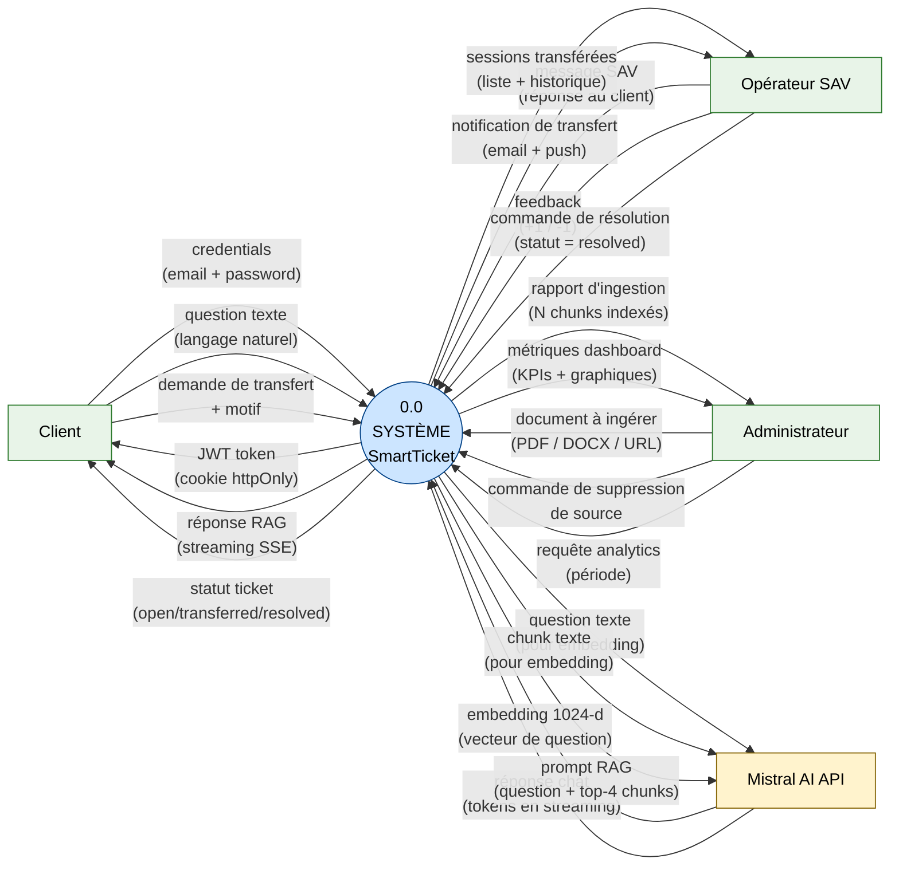

# Diagramme de flux de données (DFD)

**Projet :** SmartTicket — Gestionnaire de tickets intelligent avec assistant virtuel  
**Méthode :** DFD (Data Flow Diagram) — niveaux 0 et 1  
**Référence :** Gane & Sarson / DeMarco & Yourdon (formalisme DFD classique)

---

## Légende des conventions Mermaid utilisées

| Forme Mermaid | Signification DFD | Rôle |
|---|---|---|
| `["Nom"]` rectangle | **Entité externe** (terminateur) | Source ou destination de données extérieure au système : Client, Opérateur SAV, Administrateur, Mistral API |
| `(("N.0\nNom"))` double cercle | **Processus** (numéroté) | Transformation de données au sein du système |
| `[("DN — Nom")]` cylindre | **Datastore** | Stockage persistant ou temporaire de données |
| `-->|"étiquette"|` flèche étiquetée | **Flux de données** | Donnée qui circule entre deux éléments ; l'étiquette nomme explicitement la donnée |

> Un DFD représente **quelles données circulent** et **entre quels éléments**, pas comment les traitements sont implantés. Il ne décrit pas la séquence temporelle (pour cela, voir les diagrammes de séquence dans `docs/C14/03_parcours_utilisateurs.md`).

---

## 2.1 DFD Niveau 0 — Diagramme de contexte

Le système SmartTicket est représenté comme une boîte noire unique (`0.0 SmartTicket`). Seules les entités externes et les flux de données entrants/sortants sont visibles.

---

## 2.2 DFD Niveau 1 — Décomposition en processus internes

Le système est décomposé en 6 processus numérotés. Les datastores correspondent directement aux tables PostgreSQL (D1–D5, D7) et au cache Redis (D6) définis dans le MPD (`docs/C14/02_modelisation_donnees.md`).

```mermaid
flowchart TD
    %% ══════════════════════════════════════════════════════════════
    %% ENTITÉS EXTERNES
    %% ══════════════════════════════════════════════════════════════
    CLIENT["Client"]
    OPERATEUR["Opérateur SAV"]
    ADMIN["Administrateur"]
    MISTRAL["Mistral AI API"]

    %% ══════════════════════════════════════════════════════════════
    %% PROCESSUS (double cercle = cercle Mermaid)
    %% ══════════════════════════════════════════════════════════════
    P1(("1.0\nAuthentifier\nutilisateur"))
    P2(("2.0\nGérer\nconversation"))
    P3(("3.0\nTraiter question\nRAG"))
    P4(("4.0\nIngérer\ndocument"))
    P5(("5.0\nRouter vers\nopérateur"))
    P6(("6.0\nCalculer\nanalytics"))

    %% ══════════════════════════════════════════════════════════════
    %% DATASTORES (cylindre = base de données)
    %% ══════════════════════════════════════════════════════════════
    D1[("D1\nutilisateur")]
    D2[("D2\nticket")]
    D3[("D3\nmessage\n+ feedback")]
    D4[("D4\narticle")]
    D5[("D5\nchunk\n+ embedding")]
    D6[("D6\nCache Redis")]
    D7[("D7\nAnalytics\nagrégés")]

    %% ══════════════════════════════════════════════════════════════
    %% FLUX — 1.0 Authentifier utilisateur
    %% ══════════════════════════════════════════════════════════════
    CLIENT      -->|"credentials\n(email + password)"| P1
    P1          -->|"requête profil\n(email)"| D1
    D1          -->|"profil utilisateur\n+ rôle + password_hash"| P1
    P1          -->|"JWT token\n(access 15 min\n+ refresh 7 j)"| CLIENT

    %% ══════════════════════════════════════════════════════════════
    %% FLUX — 2.0 Gérer conversation
    %% ══════════════════════════════════════════════════════════════
    CLIENT      -->|"question texte\n+ ticket_id (JWT)"| P2
    P2          -->|"création / lecture ticket"| D2
    D2          -->|"metadata ticket\n(statut, id_utilisateur)"| P2
    P2          -->|"message user — INSERT\n(type_envoyeur='user')"| D3
    P2          -->|"question + historique\n(derniers N messages)"| P3
    P3          -->|"réponse IA\nformatée"| P2
    P2          -->|"message AI — INSERT\n(type_envoyeur='ai')"| D3
    P2          -->|"réponse streaming\n(SSE tokens)"| CLIENT

    OPERATEUR   -->|"message SAV\n(type_envoyeur='sav')"| P2
    P2          -->|"message SAV — INSERT"| D3
    OPERATEUR   -->|"feedback valeur\n(+1 ou -1)"| P2
    P2          -->|"feedback — UPDATE\n(sur message AI)"| D3

    %% ══════════════════════════════════════════════════════════════
    %% FLUX — 3.0 Traiter question (RAG)
    %% ══════════════════════════════════════════════════════════════
    P3          -->|"question texte\n(embed request)"| MISTRAL
    MISTRAL     -->|"embedding 1024-d\n(vecteur question)"| P3
    P3          -->|"clé de cache\n(SHA-256 question)"| D6
    D6          -->|"réponse cachée\n(hit) ou miss"| P3
    P3          -->|"vecteur requête\n(similarité cosinus HNSW)"| D5
    D5          -->|"top-4 chunks\n(contenu + score cosinus)"| P3
    P3          -->|"prompt RAG complet\n(question + top-4 chunks)"| MISTRAL
    MISTRAL     -->|"réponse générée\n(tokens en streaming)"| P3
    P3          -->|"réponse — SET cache\n(TTL 3600 s)"| D6

    %% ══════════════════════════════════════════════════════════════
    %% FLUX — 4.0 Ingérer document
    %% ══════════════════════════════════════════════════════════════
    ADMIN       -->|"fichier PDF/DOCX/TXT\nou URL + metadata"| P4
    P4          -->|"article — INSERT\n(titre, source_url)"| D4
    D4          -->|"article_id\n(confirmation)"| P4
    P4          -->|"chunk texte\n(500 car., overlap 50)\n(embed request)"| MISTRAL
    MISTRAL     -->|"embedding 1024-d\n(par chunk)"| P4
    P4          -->|"chunk + vecteur — INSERT\n(vector(1024))"| D5
    P4          -->|"rapport ingestion\n(N chunks, statut)"| ADMIN

    %% ══════════════════════════════════════════════════════════════
    %% FLUX — 5.0 Router vers opérateur
    %% ══════════════════════════════════════════════════════════════
    CLIENT      -->|"demande transfert\n+ motif (technique/\ncomplexe/sensible/autre)"| P5
    P5          -->|"vérification propriété\n(ticket.id_utilisateur)"| D2
    D2          -->|"ticket validé\n(statut='open')"| P5
    P5          -->|"UPDATE statut\n='transferred'\n+ motif_transfert"| D2
    P5          -->|"notification push\n(email + WebSocket)"| OPERATEUR
    P5          -->|"confirmation transfert\n(statut='transferred')"| CLIENT
    OPERATEUR   -->|"requête sessions\ntransférées"| P5
    P5          -->|"lecture sessions\ntransférées"| D2
    D2          -->|"liste sessions\n(statut='transferred')"| P5
    P5          -->|"sessions transférées\n(triées par ancienneté)"| OPERATEUR

    %% ══════════════════════════════════════════════════════════════
    %% FLUX — 6.0 Calculer analytics
    %% ══════════════════════════════════════════════════════════════
    ADMIN       -->|"requête analytics\n(période 7/30/90 j)"| P6
    P6          -->|"vérification cache\nanalytics"| D6
    D6          -->|"métriques cachées\n(TTL 1 h) ou miss"| P6
    P6          -->|"COUNT tickets\npar statut et motif"| D2
    D2          -->|"agrégats tickets\n(taux résolution IA,\nnb transferts/motif)"| P6
    P6          -->|"COUNT messages\n+ feedbacks par période"| D3
    D3          -->|"score satisfaction\n(feedbacks +1/-1)"| P6
    P6          -->|"UPDATE métriques\nagrégées"| D7
    D7          -->|"métriques précalculées\n(snapshots)"| P6
    P6          -->|"SET cache analytics\n(TTL 3600 s)"| D6
    P6          -->|"KPIs + données graphiques\n(JSON)"| ADMIN

    %% ══════════════════════════════════════════════════════════════
    %% STYLES
    %% ══════════════════════════════════════════════════════════════
    style CLIENT    fill:#e8f4e8,stroke:#2d7a2d,color:#000
    style OPERATEUR fill:#e8f4e8,stroke:#2d7a2d,color:#000
    style ADMIN     fill:#e8f4e8,stroke:#2d7a2d,color:#000
    style MISTRAL   fill:#fff3cd,stroke:#856404,color:#000

    style P1 fill:#cce5ff,stroke:#004085,color:#000
    style P2 fill:#cce5ff,stroke:#004085,color:#000
    style P3 fill:#cce5ff,stroke:#004085,color:#000
    style P4 fill:#cce5ff,stroke:#004085,color:#000
    style P5 fill:#cce5ff,stroke:#004085,color:#000
    style P6 fill:#cce5ff,stroke:#004085,color:#000

    style D1 fill:#fde8d8,stroke:#7d3c00,color:#000
    style D2 fill:#fde8d8,stroke:#7d3c00,color:#000
    style D3 fill:#fde8d8,stroke:#7d3c00,color:#000
    style D4 fill:#fde8d8,stroke:#7d3c00,color:#000
    style D5 fill:#fde8d8,stroke:#7d3c00,color:#000
    style D6 fill:#f0e6ff,stroke:#6a0dad,color:#000
    style D7 fill:#fde8d8,stroke:#7d3c00,color:#000
```

---

## 2.3 Correspondance datastores ↔ modèle de données C14

| Datastore DFD | Table PostgreSQL (MPD C14) | Colonnes clés impliquées dans les flux |
|---|---|---|
| **D1 — utilisateur** | `utilisateur` | `email`, `password_hash`, `id_role` → processus 1.0 (authentification) |
| **D2 — ticket** | `ticket` | `statut`, `motif_transfert`, `id_utilisateur` → processus 2.0, 5.0, 6.0 |
| **D3 — message + feedback** | `message`, `feedback` | `type_envoyeur` IN ('user','ai','sav'), `contenu`, `feedback.valeur` → processus 2.0, 6.0 |
| **D4 — article** | `article` | `titre`, `source_url`, `id_categorie` → processus 4.0 |
| **D5 — chunk + embedding** | `chunk` | `contenu`, `embedding vector(1024)`, index HNSW → processus 3.0 (similarité cosinus), 4.0 (INSERT) |
| **D6 — Cache Redis** | Redis (hors schéma SQL) | Clé = `SHA-256(question)` → réponses RAG ; clé = `analytics:{periode}` → métriques ; blacklist tokens JWT |
| **D7 — Analytics agrégés** | Vues matérialisées ou table `analytics_snapshot` | `taux_resolution_ia`, `score_satisfaction`, `nb_transferts_par_motif` → processus 6.0 |

---

## 2.4 Flux de données critiques — description textuelle

Les flux ci-dessous décrivent les données exactes qui circulent pour les scénarios nominaux des user stories C14.

### Flux RAG complet (US-01, US-02)

1. **Client → P2** : `{ question: "Comment réinitialiser mon mot de passe ?", ticket_id: 42 }` (JWT cookie httpOnly).
2. **P2 → D3** : `INSERT message(type_envoyeur='user', contenu="Comment...", id_ticket=42)` → retour `message_id=201`.
3. **P2 → P3** : `{ question: "Comment réinitialiser mon mot de passe ?", historique: [msg_197, msg_198, msg_199] }`.
4. **P3 → Mistral** : `POST /v1/embeddings { input: "Comment réinitialiser mon mot de passe ?", model: "mistral-embed" }`.
5. **Mistral → P3** : `{ embedding: [0.023, -0.114, ..., 0.087] }` (1024 flottants).
6. **P3 → D6** : `GET cache:SHA256("comment réinitialiser mon mot de passe")` → MISS.
7. **P3 → D5** : `SELECT contenu, 1 - (embedding <=> '[0.023,...]'::vector) AS score FROM chunk ORDER BY embedding <=> '[0.023,...]' LIMIT 4` via index HNSW.
8. **D5 → P3** : `[{ contenu: "Pour réinitialiser votre mot de passe...", score: 0.91 }, ...]` (4 chunks).
9. **P3 → Mistral** : `POST /v1/chat/completions { model: "mistral-large-latest", messages: [{ role: "system", content: "Contexte: [chunk1, chunk2, chunk3, chunk4]" }, { role: "user", content: "Comment réinitialiser mon mot de passe ?" }], stream: true }`.
10. **Mistral → P3 → P2 → Client** : tokens SSE `data: { delta: "Pour" }`, `data: { delta: " réinitialiser" }`, ..., `data: [DONE]`.
11. **P3 → D6** : `SET cache:SHA256(...) = "réponse complète" EX 3600`.
12. **P2 → D3** : `INSERT message(type_envoyeur='ai', contenu="Pour réinitialiser...", id_ticket=42)`.

### Flux de transfert vers opérateur (US-03)

1. **Client → P5** : `{ ticket_id: 42, motif: "complexe" }` (JWT vérifié : `user_id=15`).
2. **P5 → D2** : `SELECT id, statut, id_utilisateur FROM ticket WHERE id=42` → vérification `id_utilisateur=15` et `statut='open'`.
3. **P5 → D2** : `UPDATE ticket SET statut='transferred', motif_transfert='complexe' WHERE id=42`.
4. **P5 → Opérateur** : `POST /notifications/send { recipients: [users WHERE role='sav'], event: "session_transferred", payload: { ticket_id: 42, motif: "complexe", client_id: 15 } }`.
5. **P5 → Client** : `{ status: "transferred", message: "Vous êtes en attente d'un opérateur" }`.

### Flux d'ingestion documentaire (US-07)

1. **Admin → P4** : `multipart/form-data { file: document.pdf, titre: "Guide utilisateur", id_categorie: 3 }`.
2. **P4 → D4** : `INSERT article(titre, source_url=null, id_categorie=3)` → retour `article_id=12`.
3. **P4** : parse PDF → `contenu_brut` (25 000 mots) → découpage en N chunks de 500 caractères (overlap 50).
4. **Pour chaque chunk** : **P4 → Mistral** : `POST /v1/embeddings { input: chunk.contenu, model: "mistral-embed" }` → embedding 1024-d → **P4 → D5** : `INSERT chunk(contenu, embedding, id_article=12)`.
5. **P4 → Admin** : `{ job_id: "job-abc", status: "completed", chunks_created: 48, article_id: 12 }`.
