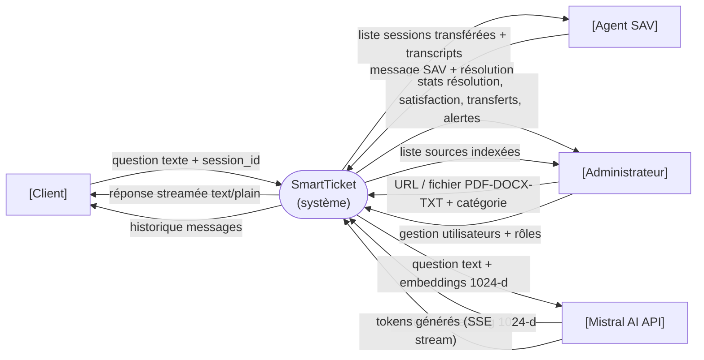

# Livrable 2 — Diagramme de flux de données (DFD)
## SmartTicket — Pipeline RAG et gestion de tickets

> Les diagrammes sont construits à partir de l'analyse du code source (`backend/routers/`, `backend/mistral_client.py`, `backend/dependencies.py`). Chaque flux est étiqueté avec la donnée réelle qui circule.

---

## 2.1 DFD Niveau 0 — Contexte (vue boîte noire)

SmartTicket est représenté comme un système unique. Les entités externes interagissent avec lui via leurs flux principaux.

---

## 2.2 DFD Niveau 1 — Décomposition des processus internes

Les processus numérotés correspondent aux modules effectivement présents dans le code.

```mermaid
flowchart TD
    Client["[Client]"]
    Operateur["[Agent SAV]"]
    Admin["[Administrateur]"]
    MistralEmbed["[Mistral AI\nmistral-embed]"]
    MistralGen["[Mistral AI\nmistral-small-latest]"]

    D1[("D1 — utilisateur\nPostgreSQL")]
    D2[("D2 — chat_sessions\nPostgreSQL")]
    D3[("D3 — chat_messages\nPostgreSQL")]
    D4[("D4 — knowledge_base\nvector 1024-d\nPostgreSQL + pgvector")]

    P1(["1.0\nAuthentification\nJWT + bcrypt"])
    P2(["2.0\nGestion\nsessions"])
    P3(["3.0\nPipeline RAG\nask/stream"])
    P4(["4.0\nIngestion\nbase de connaissances"])
    P5(["5.0\nAnalytics\nSAV / Admin"])
    P6(["6.0\nGestion\nutilisateurs"])

    %% Authentification
    Client -- "email + password" --> P1
    P1 -- "lookup email" --> D1
    D1 -- "password_hash + id_role" --> P1
    P1 -- "JWT signé HS256\ncookie httpOnly SameSite=strict" --> Client

    %% Sessions
    Client -- "JWT + title" --> P2
    P2 -- "vérif JWT" --> D1
    P2 -- "create/read/delete session" --> D2
    P2 -- "question context" --> P3

    %% RAG Pipeline
    Client -- "question texte + session_id + mode" --> P3
    P3 -- "question texte" --> MistralEmbed
    MistralEmbed -- "embedding 1024-d" --> P3
    P3 -- "cosine_distance(embedding) TOP-K=4" --> D4
    D4 -- "top-k chunks texte" --> P3
    P3 -- "prompt enrichi du contexte" --> MistralGen
    MistralGen -- "tokens SSE stream" --> P3
    P3 -- "write message user" --> D3
    P3 -- "write message ai (réponse complète)" --> D3
    P3 -- "réponse streamée text/plain" --> Client

    %% Feedback
    Client -- "feedback 1 ou -1 + message_id" --> D3

    %% Transfert SAV
    Client -- "reason = technique/complexe/sensible/autre" --> P2
    P2 -- "status=transferred + transfer_reason" --> D2
    P2 -- "sessions transférées + username" --> Operateur
    Operateur -- "message SAV + session_id" --> D3
    Operateur -- "resolve = status=open" --> P2

    %% Clôture session
    Client -- "close session_id" --> P2
    P2 -- "read messages (50 max)" --> D3
    P2 -- "transcript texte" --> MistralGen
    MistralGen -- "résumé 5-8 lignes" --> P2
    P2 -- "résumé text" --> MistralEmbed
    MistralEmbed -- "embedding résumé 1024-d" --> P2
    P2 -- "insert chunks résumé + transcript\ncategory=ticket_summary/ticket_transcript" --> D4
    P2 -- "status=closed" --> D2

    %% Ingestion KB
    Admin -- "URL/sitemap ou fichier PDF-DOCX-TXT" --> P4
    P4 -- "contenu texte découpé en chunks" --> MistralEmbed
    MistralEmbed -- "embedding chunk 1024-d" --> P4
    P4 -- "insert chunk + embedding + source + category" --> D4

    %% Analytics
    Admin -- "GET analytics/stats?days=N" --> P5
    Operateur -- "GET analytics/stats?days=N" --> P5
    P5 -- "count sessions, messages, feedback" --> D3
    P5 -- "count transferred, transfer_reason" --> D2
    P5 -- "query users SAV" --> D1
    P5 -- "stats + alertes + graphiques" --> Admin
    P5 -- "stats + alertes + graphiques" --> Operateur

    %% Gestion utilisateurs
    Admin -- "PUT users/id/role\nDELETE users/id" --> P6
    P6 -- "update id_role\ndelete CASCADE" --> D1
```

---

## Légende des flux

| Flux | Type de donnée |
|---|---|
| `email + password` | Credentials JSON (Pydantic UserLogin) |
| `JWT signé HS256` | Token JWT dans cookie httpOnly (max_age=3600s) |
| `question texte + session_id` | JSON `{question, session_id, mode}` |
| `embedding 1024-d` | Vecteur float32[1024] (mistral-embed) |
| `cosine_distance TOP-K=4` | Requête pgvector `ORDER BY embedding <=> query_vec LIMIT 4` |
| `top-k chunks texte` | Liste de strings (contenu des lignes knowledge_base) |
| `prompt enrichi du contexte` | String concaténant contexte KB + question (max 3000 chars) |
| `tokens SSE stream` | `text/plain` chunked (Server-Sent stream Mistral) |
| `feedback 1 ou -1` | PATCH `{feedback: 1|-1}` → colonne `chat_messages.feedback` |
| `status=transferred` | UPDATE `chat_sessions.status + transfer_reason` |
| `insert chunks résumé` | Entrées `knowledge_base` category=`ticket_summary`/`ticket_transcript` |
| `stats + alertes` | JSON avec `ai_resolution_rate`, `satisfaction_score`, `transfer_reasons`, `alerts[]` |

---

## Datastores détaillés

| Datastore | Table SQL | Colonnes clés | Usage |
|---|---|---|---|
| D1 | `utilisateur` | id, email, password_hash, id_role | Auth, RBAC, liste agents SAV |
| D2 | `chat_sessions` | id, id_utilisateur, status, transfer_reason | Gestion cycle de vie des tickets |
| D3 | `chat_messages` | id, id_session, type_envoyeur, contenu, feedback | Historique + analytics feedback |
| D4 | `knowledge_base` | id, contenu, embedding vector(1024), category, source | Recherche vectorielle RAG (index HNSW cosine) |

> **Note sur Redis** : un datastore D5 (Redis) était prévu pour la mise en cache des sessions/résultats LLM mais n'est pas connecté dans le code actuel. L'état des jobs d'ingestion est stocké en mémoire vive (`INGEST_JOBS` dict dans `dependencies.py:27`).
