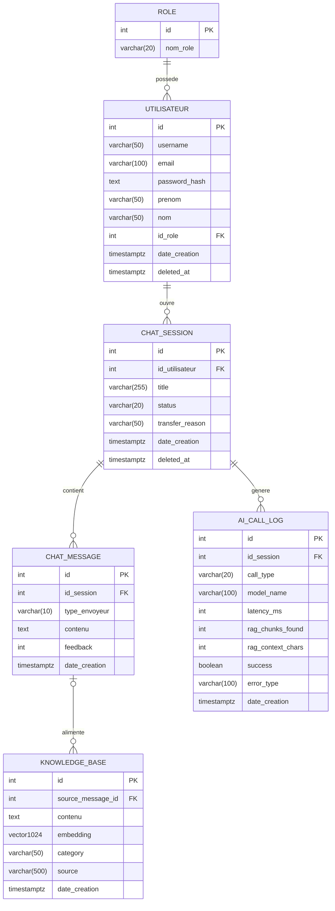

# Modélisation Merise — SmartTicket

**Projet :** SmartTicket — Gestionnaire de tickets RAG  
**Bloc :** B1 — Critère C4 (Base de données)  
**Source :** `backend/models.py` + `backend/db/init-db.sql`  
**Date :** 2026-05-16

---

## 2.1 Modèle Conceptuel de Données (MCD)

> **Lecture des cardinalités Merise** : la notation `(min,max)` est placée entre l'entité et l'association.  
> `(0,n)` = "participe de 0 à plusieurs fois" · `(1,1)` = "participe exactement une fois" · `(0,1)` = "participe 0 ou 1 fois" · `(1,n)` = "participe au moins une fois"



---

### Cardinalités Merise dans le diagramme

Les symboles Mermaid et leur équivalent Merise :

| Symbole Mermaid | Équivalent Merise | Sens |
|-----------------|-------------------|------|
| `\|\|` | `(1,1)` | Exactement une participation |
| `o\|` | `(0,1)` | Zéro ou une participation |
| `o{` | `(0,n)` | Zéro ou plusieurs participations |
| `\|{` | `(1,n)` | Une ou plusieurs participations |

#### Lecture des associations dans ce modèle

| Association | Entité A (cardinalité) | Entité B (cardinalité) |
|-------------|------------------------|------------------------|
| ROLE —possede— UTILISATEUR | Un rôle est possédé par `(0,n)` utilisateurs | Un utilisateur possède exactement `(1,1)` rôle |
| UTILISATEUR —ouvre— CHAT_SESSION | Un utilisateur ouvre `(0,n)` sessions | Une session est ouverte par exactement `(1,1)` utilisateur |
| CHAT_SESSION —contient— CHAT_MESSAGE | Une session contient `(0,n)` messages | Un message appartient à exactement `(1,1)` session |
| CHAT_SESSION —genere— AI_CALL_LOG | Une session génère `(0,n)` logs IA | Un log est généré par `(0,1)` session *(FK nullable)* |
| CHAT_MESSAGE —alimente— KNOWLEDGE_BASE | Un message alimente `(0,n)` entrées KB | Une entrée KB provient de `(0,1)` message *(FK nullable)* |

---

## 2.2 Lecture des cardinalités (tableau pédagogique)

| Association | Côté A | Côté B |
|-------------|--------|--------|
| ROLE —possède— UTILISATEUR | Un rôle peut être attribué à 0 ou plusieurs utilisateurs | Un utilisateur se voit attribuer exactement 1 rôle |
| UTILISATEUR —ouvre— CHAT_SESSION | Un utilisateur ouvre de 0 à plusieurs sessions de chat | Une session de chat est ouverte par exactement 1 utilisateur |
| CHAT_SESSION —contient— CHAT_MESSAGE | Une session de chat contient de 0 à plusieurs messages | Un message appartient à exactement 1 session de chat |
| CHAT_SESSION —génère— AI_CALL_LOG | Une session de chat génère de 0 à plusieurs logs d'appel IA | Un log d'appel IA est associé à 0 ou 1 session *(nullable — log possible hors session)* |
| CHAT_MESSAGE —alimente— KNOWLEDGE_BASE | Un message de chat peut alimenter de 0 à plusieurs entrées de la base de connaissances | Une entrée de la base de connaissances est issue de 0 ou 1 message *(nullable — ingestion externe possible)* |

---

## 2.3 Modèle Logique de Données (MLD)

> Convention : **clé primaire soulignée** (`PK`), clé étrangère préfixée de `#` (`FK`), attribut nullable noté `[?]`

```
ROLE ( PK:id, nom_role )

UTILISATEUR ( PK:id, username, email, password_hash, prenom[?], nom[?],
              #id_role → ROLE.id,
              date_creation, deleted_at[?] )

CHAT_SESSION ( PK:id, #id_utilisateur → UTILISATEUR.id,
               title[?], status, transfer_reason[?],
               date_creation, deleted_at[?] )

CHAT_MESSAGE ( PK:id, #id_session → CHAT_SESSION.id,
               type_envoyeur, contenu, feedback[?], date_creation )

AI_CALL_LOG ( PK:id, #id_session → CHAT_SESSION.id [nullable],
              call_type, model_name, latency_ms[?],
              rag_chunks_found[?], rag_context_chars[?],
              success, error_type[?], date_creation )

KNOWLEDGE_BASE ( PK:id, #source_message_id → CHAT_MESSAGE.id [nullable],
                 contenu, embedding (vector 1024),
                 category[?], source[?], date_creation )
```

### Règles de passage MCD → MLD appliquées

| Association | Règle appliquée | Résultat |
|-------------|-----------------|----------|
| ROLE —(1,n)/(1,1)— UTILISATEUR | FK côté `(1,1)` | `id_role` dans `UTILISATEUR` |
| UTILISATEUR —(0,n)/(1,1)— CHAT_SESSION | FK côté `(1,1)` | `id_utilisateur` dans `CHAT_SESSION` |
| CHAT_SESSION —(0,n)/(1,1)— CHAT_MESSAGE | FK côté `(1,1)` | `id_session` dans `CHAT_MESSAGE` |
| CHAT_SESSION —(0,n)/(0,1)— AI_CALL_LOG | FK côté `(0,1)` nullable | `id_session` nullable dans `AI_CALL_LOG` |
| CHAT_MESSAGE —(0,n)/(0,1)— KNOWLEDGE_BASE | FK côté `(0,1)` nullable | `source_message_id` nullable dans `KNOWLEDGE_BASE` |

---

## 2.4 Modèle Physique de Données (MPD)

> Implémentation PostgreSQL avec extension `pgvector`. Source : `backend/db/init-db.sql` + `backend/models.py`

```sql
-- Extension vectorielle pour le RAG
CREATE EXTENSION IF NOT EXISTS vector;
CREATE EXTENSION IF NOT EXISTS pgcrypto;

-- Table des rôles applicatifs
CREATE TABLE roles (
    id       SERIAL PRIMARY KEY,
    nom_role VARCHAR(20) UNIQUE NOT NULL
);

-- Comptes utilisateurs
CREATE TABLE utilisateur (
    id            SERIAL PRIMARY KEY,
    username      VARCHAR(50)  UNIQUE NOT NULL,
    email         VARCHAR(100) UNIQUE NOT NULL,
    password_hash TEXT         NOT NULL,
    prenom        VARCHAR(50),
    nom           VARCHAR(50),
    id_role       INTEGER REFERENCES roles(id) DEFAULT 1,
    date_creation TIMESTAMPTZ  DEFAULT CURRENT_TIMESTAMP,
    deleted_at    TIMESTAMPTZ                         -- soft-delete RGPD
);

-- Sessions de chat
CREATE TABLE chat_sessions (
    id             SERIAL PRIMARY KEY,
    id_utilisateur INTEGER REFERENCES utilisateur(id) ON DELETE CASCADE NOT NULL,
    title          VARCHAR(255),
    status         VARCHAR(20)  NOT NULL DEFAULT 'open',  -- open | transferred | closed
    transfer_reason VARCHAR(50),                          -- technique | complexe | sensible | autre
    date_creation  TIMESTAMPTZ  DEFAULT CURRENT_TIMESTAMP,
    deleted_at     TIMESTAMPTZ                            -- soft-delete RGPD
);

-- Messages de chat
CREATE TABLE chat_messages (
    id            SERIAL PRIMARY KEY,
    id_session    INTEGER REFERENCES chat_sessions(id) ON DELETE CASCADE NOT NULL,
    type_envoyeur VARCHAR(10) NOT NULL CHECK (type_envoyeur IN ('user', 'ai', 'sav')),
    contenu       TEXT        NOT NULL,
    feedback      INTEGER,                               -- 1 = 👍 | -1 = 👎 | NULL = sans feedback
    date_creation TIMESTAMPTZ DEFAULT CURRENT_TIMESTAMP
);

-- Journaux des appels IA (monitoring)
CREATE TABLE ai_call_logs (
    id                SERIAL PRIMARY KEY,
    id_session        INTEGER REFERENCES chat_sessions(id) ON DELETE SET NULL,  -- nullable
    call_type         VARCHAR(20)  NOT NULL,
    model_name        VARCHAR(100) NOT NULL,
    latency_ms        INTEGER,
    rag_chunks_found  INTEGER,
    rag_context_chars INTEGER,
    success           BOOLEAN      NOT NULL DEFAULT TRUE,
    error_type        VARCHAR(100),
    date_creation     TIMESTAMPTZ  DEFAULT CURRENT_TIMESTAMP
);

-- Base de connaissances vectorielle (RAG)
CREATE TABLE knowledge_base (
    id                SERIAL PRIMARY KEY,
    source_message_id INTEGER REFERENCES chat_messages(id) ON DELETE SET NULL,  -- nullable
    contenu           TEXT         NOT NULL,
    embedding         vector(1024) NOT NULL,             -- embedding Mistral-embed (1024 dimensions)
    category          VARCHAR(50),
    source            VARCHAR(500),
    date_creation     TIMESTAMPTZ  DEFAULT CURRENT_TIMESTAMP
);

-- Index HNSW pour recherche vectorielle (similarité cosinus)
CREATE INDEX ON knowledge_base USING hnsw (embedding vector_cosine_ops);
```

### Contraintes d'intégrité résumées

| Table | Contrainte | Type |
|-------|-----------|------|
| `roles` | `nom_role UNIQUE NOT NULL` | Unicité |
| `utilisateur` | `username UNIQUE`, `email UNIQUE` | Unicité |
| `utilisateur` | `id_role REFERENCES roles(id)` | Intégrité référentielle |
| `chat_sessions` | `id_utilisateur REFERENCES utilisateur(id) ON DELETE CASCADE` | Cascade suppression |
| `chat_messages` | `id_session REFERENCES chat_sessions(id) ON DELETE CASCADE` | Cascade suppression |
| `chat_messages` | `type_envoyeur CHECK IN ('user','ai','sav')` | Domaine de valeurs |
| `ai_call_logs` | `id_session REFERENCES chat_sessions(id) ON DELETE SET NULL` | FK nullable + SET NULL |
| `knowledge_base` | `source_message_id REFERENCES chat_messages(id) ON DELETE SET NULL` | FK nullable + SET NULL |
| `knowledge_base` | `embedding vector(1024) NOT NULL` | Type pgvector + obligatoire |
