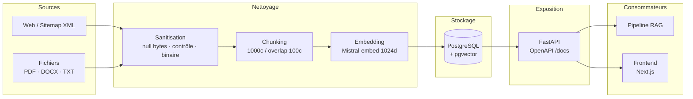

# Collecte, stockage et mise à disposition des données — SmartTicket

**Projet :** SmartTicket — Gestionnaire de tickets avec IA conversationnelle  
**Stack :** FastAPI · PostgreSQL · pgvector · Mistral AI · Next.js 15  
**Auteur :** Gabriel Guery — Mai 2026

---

## 1. Présentation du dispositif

SmartTicket est un système de support client qui s'appuie sur un modèle de langage (Mistral AI) couplé à une base de connaissances vectorielle (RAG). Pour que le modèle réponde avec précision, il doit accéder à des documents métier préalablement collectés, nettoyés et indexés dans une base PostgreSQL enrichie de l'extension pgvector.

Le schéma ci-dessous représente l'ensemble du pipeline de données, de la source brute jusqu'à la consommation par le frontend.



| Choix technique | Justification |
|-----------------|---------------|
| PostgreSQL + pgvector | Intégrité relationnelle + recherche vectorielle cosinus sans service tiers |
| Mistral-embed (1024d) | Embeddings multilingues, API cohérente avec le LLM de génération |
| FastAPI + Pydantic | Validation automatique des entrées, OpenAPI 3.1 auto-généré |
| LangChain `WebBaseLoader` | HTML stripping + chargement multi-URLs piloté par sitemap |
| `RecursiveCharacterTextSplitter` | Découpage sémantique respectant les séparateurs naturels du texte |

---

## 2. Collecte multi-sources

L'ingestion est déclenchée manuellement par un administrateur ou un agent SAV via deux endpoints dédiés, exécutés en arrière-plan (`BackgroundTasks` FastAPI) pour ne pas bloquer la requête HTTP.

| Modalité | Lib principale | Formats | Endpoint |
|----------|----------------|---------|----------|
| Web | `WebBaseLoader` (LangChain) + `requests` | URL unique, sitemap XML | `POST /v1/knowledge-base/ingest-url` |
| Fichiers | `pypdf`, `python-docx`, `bytes.decode` | PDF, DOCX, TXT | `POST /v1/knowledge-base/ingest-file` |

Points notables :
- Le **robots.txt** est consulté avant tout scraping ; les URLs interdites sont ignorées (`ingest_postgres.py:268`).
- Le **sitemap XML** est résolu en deux niveaux (sitemap index → urlsets) avec déduplication (`dict.fromkeys`) et plafond de 50 URLs par ingestion.
- L'ensemble du code est versionné dans un monorepo Git (GitHub).

---

## 3. Accès aux données : ORM principal et SQL natif ciblé

SQLAlchemy ORM est utilisé pour la quasi-totalité des requêtes. Le SQL natif est réservé aux opérations impossibles à exprimer via l'ORM : activation de l'extension pgvector, migrations DDL incrémentales au démarrage, et l'index HNSW.

La recherche vectorielle cosinus est exprimée directement en ORM pgvector :

```python
# routers/ai.py:65 — Recherche des K chunks les plus proches
kb_rows = (
    db.query(models.KnowledgeBase)
    .order_by(models.KnowledgeBase.embedding.cosine_distance(query_embedding))
    .limit(KB_TOP_K)
    .all()
)
```

| Requête ORM complexe | Usage | Fichier |
|----------------------|-------|---------|
| `date_trunc("day", ...) + group_by` | Statistiques de messages par jour | `analytics.py:68` |
| Sous-requête `sav` sessions distinctes | Calcul du taux de résolution IA | `analytics.py:64` |
| `avg(latency_ms) + group_by jour` | Tendance latence IA | `analytics.py:147` |
| `JOIN Utilisateur` sur sessions transférées | File d'attente agents SAV | `sessions.py:173` |
| `count + min(date_creation) group_by source` | Inventaire de la base de connaissances | `knowledge.py:62` |

SQLAlchemy compile ces requêtes en SQL paramétré, ce qui protège nativement contre les injections SQL.

---

## 4. Agrégation et homogénéisation

Avant insertion, chaque document passe par un pipeline de nettoyage en plusieurs étapes.

| Problème détecté | Traitement appliqué | Résultat |
|------------------|---------------------|----------|
| Null bytes (`\x00`) | `str.replace("\x00", "")` | Compatibilité PostgreSQL |
| Caractères de contrôle (`\x01–\x1F`) | `re.sub(r"[\x01-\x08...]", " ", ...)` | Texte lisible |
| Espaces multiples / sauts de ligne | `re.sub(r"\s+", " ", ...)` | Normalisation |
| Contenu binaire (EXIF, JFIF, base64 > 120c) | Score de caractères indéchiffrables > 0,2 → rejet | Qualité des chunks |
| HTML brut | `WebBaseLoader` (BeautifulSoup interne) | Texte propre |
| Document trop court | `len(content) < 80` → ignoré | Cohérence vectorielle |

Le découpage est réalisé par `RecursiveCharacterTextSplitter` (chunk_size=1000, chunk_overlap=100) avec un maximum de 80 chunks par ingestion (`MAX_KB_CHUNKS`). Les URLs du sitemap sont dédoublonnées par `dict.fromkeys`. Le dédoublonnage par hash de contenu (éviter la réingestion d'un même document) est prévu en V2.

---

## 5. Modélisation et stockage

PostgreSQL a été retenu pour sa capacité à combiner intégrité relationnelle (clés étrangères, contraintes de domaine) et stockage vectoriel natif via l'extension pgvector — sans service externe supplémentaire.

```mermaid
erDiagram
    ROLE ||--o{ UTILISATEUR : "possede (1,1)/(0,n)"
    UTILISATEUR ||--o{ CHAT_SESSION : "ouvre (1,1)/(0,n)"
    CHAT_SESSION ||--o{ CHAT_MESSAGE : "contient (1,1)/(0,n)"
    CHAT_SESSION ||--o{ AI_CALL_LOG : "genere (0,1)/(0,n)"
    CHAT_MESSAGE |o--o{ KNOWLEDGE_BASE : "alimente (0,1)/(0,n)"

    ROLE { int id PK ; varchar nom_role }
    UTILISATEUR { int id PK ; varchar username ; varchar email ; int id_role FK ; timestamptz deleted_at }
    CHAT_SESSION { int id PK ; int id_utilisateur FK ; varchar status ; timestamptz deleted_at }
    CHAT_MESSAGE { int id PK ; int id_session FK ; varchar type_envoyeur ; int feedback }
    AI_CALL_LOG { int id PK ; int id_session FK ; int latency_ms ; int rag_chunks_found ; boolean success }
    KNOWLEDGE_BASE { int id PK ; int source_message_id FK ; vector1024 embedding ; varchar category }
```

> La modélisation complète (MCD développé, MLD en notation relationnelle, MPD avec script DDL) est disponible dans `docs/B1/MODELISATION_MERISE.md`.

Les embeddings sont stockés en `vector(1024)` et la recherche de proximité est accélérée par un **index HNSW** (distance cosinus) : `CREATE INDEX ON knowledge_base USING hnsw (embedding vector_cosine_ops)` (`db/init-db.sql:98`).

---

## 6. Conformité RGPD

- **Mots de passe hashés bcrypt** — jamais en clair, jamais retournés dans les réponses API (schémas Pydantic sans `password_hash`). (`dependencies.py:13`)
- **Soft-delete** — colonnes `deleted_at` sur `utilisateur` et `chat_sessions` ; les données restent physiquement présentes pendant la période de rétention. (`models.py:25, 36`)
- **Purge automatique** — APScheduler supprime définitivement les enregistrements soft-deleted après 30 jours, en cascade (cron 03:00 UTC). (`main.py:169`)
- **Droit d'accès et portabilité** (Art. 15 & 20 RGPD) — `GET /v1/me/export` retourne l'intégralité du profil et des conversations au format JSON. (`auth.py:133`)
- **Hébergement UE** — PostgreSQL et Mistral AI (France) ; aucune donnée transmise hors Union Européenne.
- **Cookie JWT sécurisé** — HttpOnly + SameSite=strict, flag `Secure` activé en production via `COOKIE_SECURE`. (`auth.py:82`)

---

## 7. Mise à disposition via API REST

FastAPI expose 25 endpoints REST organisés en 7 routers. La documentation interactive OpenAPI 3.1 est disponible à `/docs` et `/redoc` sans configuration supplémentaire.

| Méthode | Chemin | Rôle | Description |
|---------|--------|------|-------------|
| `POST` | `/v1/login` | — | Authentification, retourne JWT + cookie |
| `GET` | `/v1/me/export` | user | Export RGPD complet (Art. 15 & 20) |
| `POST` | `/v1/ask/stream` | user | Question → RAG + streaming Mistral |
| `POST` | `/v1/sessions/{id}/transfer` | user | Transfert vers agent humain |
| `POST` | `/v1/knowledge-base/ingest-url` | admin/sav | Indexation web en arrière-plan |
| `POST` | `/v1/knowledge-base/ingest-file` | admin/sav | Indexation PDF/DOCX/TXT |
| `GET` | `/v1/analytics/stats` | admin/sav | Taux de résolution, satisfaction |
| `GET` | `/v1/analytics/ai-metrics` | admin/sav | Latence, taux d'erreur, qualité RAG |

**Sécurité :** JWT HS256, double authentification (Bearer token ou cookie HttpOnly), RBAC 3 rôles (user / sav / admin), validation Pydantic sur toutes les entrées. Mesures OWASP appliquées : A01 (contrôle d'accès + ownership sur chaque ressource), A02 (bcrypt + JWT signé), A03 (ORM paramétré), A07 (cookie SameSite=strict), A09 (journalisation structurée + table `ai_call_logs`).

---

## 8. Bilan et perspectives

| Dimension | Réalisation |
|-----------|-------------|
| Collecte | 2 modalités (web + fichiers), 5 formats (URL, sitemap, PDF, DOCX, TXT) |
| Nettoyage | Chunks 1 000c / overlap 100c · filtrage binaire · max 80 chunks/ingestion |
| Stockage | 6 entités · extension pgvector · index HNSW cosinus · vector(1024) |
| RGPD | Soft-delete · purge 30 j · export Art. 15/20 · bcrypt · cookie sécurisé |
| Exposition | 25 endpoints · OpenAPI 3.1 · JWT HS256 · RBAC 3 rôles |

**Évolutions prévues (V2) :**
- Mise en place d'**Alembic** pour la traçabilité versionée des évolutions de schéma
- Ajout d'**index sur les clés étrangères** (`id_utilisateur`, `id_session`) pour les performances des JOIN
- **Dédoublonnage par hash** de contenu sur `knowledge_base` (éviter la réingestion d'un document identique)
- **Pseudonymisation** de `id_session` dans `ai_call_logs` (renforcement RGPD)
- **Scheduler automatique** d'ingestion pour maintenir la fraîcheur de la base de connaissances

---

*Document produit à partir du code source du dépôt SmartTicket (branche `main`, mai 2026).  
Modélisation complète : `docs/B1/MODELISATION_MERISE.md` · Audit détaillé : `docs/B1/AUDIT_B1.md`*
